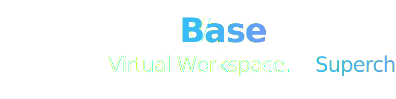

<p align="center">
  
</p>

<br>

### Real-Time Collaborative Virtual Workspace

[](https://nextjs.org/)
[](https://reactjs.org/)
[](https://convex.dev/)
[](https://clerk.com/)
[](https://liveblocks.io/)
[](https://livekit.io/)
[](https://typescriptlang.org/)
[](https://tailwindcss.com/)

> **A powerful real-time collaborative workspace** where teams can edit documents, write code, brainstorm on whiteboards, and have video meetings — all in one unified platform.

---

## 🌟 Project Overview

**VBase** is an all-in-one collaborative virtual workspace that brings together document editing, code collaboration, whiteboard brainstorming, and video conferencing into a seamless, real-time experience. Think of it as your team's virtual office where everyone can work together regardless of location.

### 🎯 The Problem We Solve

Modern teams face fragmented collaboration:
- **Document editing** → Google Docs
- **Code collaboration** → VS Code Live Share
- **Whiteboarding** → Miro/Figma
- **Video calls** → Zoom/Google Meet
- **Team chat** → Slack/Discord

**The Result:** Constantly switching between apps, losing context, and paying for multiple subscriptions.

### 💡 Our Solution

VBase unifies all collaboration tools in one workspace:

| Feature | Description |
|---------|-------------|
| 📝 **Documents** | Real-time collaborative rich text editing (Google Docs-style) |
| 💻 **Code Rooms** | Multi-file code collaboration with live cursors and code execution |
| 🎨 **Whiteboards** | Infinite canvas for brainstorming with real-time sync |
| 📹 **Video Meetings** | HD video conferencing with up to 3 concurrent meetings |
| 💬 **Team Chat** | Workspace-wide and direct messaging with reactions |

---

### Our sister project complimenting VBase
**⚙️ [vbase-rce](https://github.com/SillyCatto/vbase-rce)**: Our own experimental RCE engine built with FastAPI and Docker for code execution in Code Room

---

## ✨ Key Features

### 📝 Collaborative Document Editor
- **Rich Text Editing**: Full formatting with Tiptap-powered editor (bold, italic, headings, lists, images, links)
- **Real-Time Sync**: See teammates' cursors and edits instantly via Liveblocks Yjs
- **A4 Page Layout**: Professional document view with rulers, margins, and page breaks
- **Export Options**: Download documents as PDF
- **Connection Status**: Visual indicators for sync status

### 💻 Real-Time Code Editor
- **Multi-Language Support**: JavaScript, Python, Java, C, C++
- **Live Collaboration**: Real-time cursor presence with colored user indicators
- **Dual Code Execution Engines**:
  - **Piston API** - Public code execution service
  - **VBase RCE** - Custom Azure-hosted execution engine
- **File Explorer**: Create files and folders with hierarchical organization
- **VS Code Themes**: Light and dark mode with VS Code-style syntax highlighting
- **Integrated Terminal**: View execution output directly in the editor

### 🎨 Whiteboard Canvas
- **Infinite Canvas**: Powered by Excalidraw for free-form drawing
- **Real-Time Sync**: See teammates drawing in real-time
- **Rich Toolset**: Shapes, arrows, text, freehand drawing, and more
- **Persistent Storage**: Whiteboards save to database automatically

### 📹 Video Conferencing
- **HD Video & Audio**: Crystal clear communication via LiveKit
- **Meeting Lobby**: Preview camera/mic before joining
- **Multiple Meetings**: Up to 3 concurrent meetings per conference room
- **Participant Management**: See who's in the call with host identification
- **Meeting Cleanup**: Automatic resource cleanup on leave/disconnect

### 💬 Integrated Chat System
- **Workspace Chat**: `#general` channel for team-wide communication
- **Direct Messages**: Private 1:1 conversations between team members
- **Message Reactions**: Like, dislike, and haha reactions
- **Unread Tracking**: Badge notifications for unread messages
- **Floating UI**: Non-intrusive chat bubble accessible from anywhere

### 🏢 Workspace Management
- **Organization-Based**: Workspaces tied to Clerk Organizations
- **Member Management**: Invite team members via email
- **Room Types**: Create Document, Code, Whiteboard, or Conference rooms
- **Access Control**: Room-level permissions for team members

---

## 🛠️ Tech Stack

### **Frontend**
| Technology | Purpose |
|------------|---------|
| **Next.js 16** | React framework with App Router |
| **React 18** | UI component library |
| **TypeScript** | Type-safe development |
| **Tailwind CSS 4** | Utility-first styling |
| **Framer Motion** | Smooth animations |
| **Lucide React** | Beautiful icons |

### **Backend & Database**
| Technology | Purpose |
|------------|---------|
| **Convex** | Real-time database & backend functions |
| **Clerk** | Authentication & organization management |

### **Real-Time Collaboration**
| Technology | Purpose |
|------------|---------|
| **Liveblocks** | Cursor presence, Yjs sync, real-time events |
| **Yjs** | CRDT-based document collaboration |
| **LiveKit** | WebRTC video/audio streaming |

### **Editors & Tools**
| Technology | Purpose |
|------------|---------|
| **[vbase-rce](https://github.com/SillyCatto/vbase-rce)** | Our own experimental RCE engine |
| **Tiptap** | Rich text document editing |
| **CodeMirror** | Code editing with syntax highlighting |
| **Excalidraw** | Whiteboard drawing canvas |
| **Piston API** | An advanced & secured public RCE engine API |

---

## 🏗️ Architecture Overview

```
┌─────────────────────────────────────────────────────────────────┐
│                        CLIENT (Next.js)                         │
├─────────────────────────────────────────────────────────────────┤
│  ClerkProvider → ConvexProvider → LiveblocksProvider            │
│                                                                 │
│  ┌──────────────┐  ┌──────────────┐  ┌──────────────┐           │
│  │  Documents   │  │  Code Editor │  │  Whiteboard  │           │
│  │  (Tiptap)    │  │ (CodeMirror) │  │ (Excalidraw) │           │
│  └──────────────┘  └──────────────┘  └──────────────┘           │
│                                                                 │
│  ┌──────────────┐  ┌──────────────┐                             │
│  │   Meetings   │  │  Chat System │                             │
│  │  (LiveKit)   │  │   (Convex)   │                             │
│  └──────────────┘  └──────────────┘                             │
└─────────────────────────────────────────────────────────────────┘
                              │
          ┌───────────────────┼───────────────────┐
          ▼                   ▼                   ▼
   ┌─────────────┐    ┌─────────────┐    ┌─────────────┐
   │   Convex    │    │  Liveblocks │    │   LiveKit   │
   │  (Database) │    │   (Sync)    │    │   (Video)   │
   └─────────────┘    └─────────────┘    └─────────────┘
```

### Data Flow
- **Persistent Data → Convex**: Users, workspaces, rooms, chat messages, file metadata
- **Ephemeral Data → Liveblocks**: Cursor positions, editor state (Yjs), whiteboard drawings
- **Video/Audio → LiveKit**: Real-time media streaming

---

## 📁 Project Structure

```
vbase/
├── app/                          # Next.js App Router
│   ├── api/                      # API routes
│   │   ├── liveblocks-auth/      # Liveblocks authentication
│   │   ├── livekit/token/        # LiveKit token generation
│   │   └── leave-meeting/        # Meeting cleanup endpoint
│   ├── dashboard/                # Dashboard pages
│   │   ├── page.tsx              # Workspace list
│   │   └── invitations/          # Pending invitations
│   └── workspace/[workspaceId]/  # Workspace pages
│       └── room/[roomId]/        # Room type routes
│           ├── document/         # Document editor
│           ├── code/             # Code editor
│           ├── whiteboard/       # Whiteboard canvas
│           └── meeting/          # Video conferencing
├── components/                   # React components
│   ├── chat/                     # Chat system components
│   ├── code/                     # Code editor components
│   ├── document/                 # Document editor components
│   ├── meeting/                  # Video meeting components
│   ├── rooms/                    # Room management
│   ├── whiteboard/               # Whiteboard components
│   └── ui/                       # Shared UI primitives
├── convex/                       # Convex backend
│   ├── schema.ts                 # Database schema
│   ├── users.ts                  # User operations
│   ├── workspaces.ts             # Workspace operations
│   ├── rooms.ts                  # Room operations
│   ├── documents.ts              # Document operations
│   ├── codeFiles.ts              # Code file operations
│   ├── whiteboards.ts            # Whiteboard operations
│   ├── meetings.ts               # Meeting operations
│   ├── channels.ts               # Chat channels
│   └── messages.ts               # Chat messages
├── lib/                          # Utility functions
│   ├── piston.ts                 # Piston RCE integration
│   └── vbase-rce.ts              # Custom RCE integration
├── providers/                    # Context providers
│   ├── convex-client-provider.tsx
│   ├── liveblocks-provider.tsx
│   └── livekit-provider.tsx
└── liveblocks.config.ts          # Liveblocks type definitions
```

---

## 🚀 Getting Started

### Prerequisites
- **Node.js** v18 or higher
- **npm** or **yarn**
- **Convex** account ([convex.dev](https://convex.dev))
- **Clerk** account ([clerk.com](https://clerk.com))
- **Liveblocks** account ([liveblocks.io](https://liveblocks.io))
- **LiveKit** account ([livekit.io](https://livekit.io)) — for video features

### 1. Clone the Repository
```bash
git clone https://github.com/your-username/vbase.git
cd vbase
```

### 2. Install Dependencies
```bash
npm install
```

### 3. Configure Environment Variables
Create a `.env.local` file in the root directory:

```env
# Convex
CONVEX_DEPLOYMENT=your_convex_deployment
NEXT_PUBLIC_CONVEX_URL=https://your-deployment.convex.cloud

# Clerk
NEXT_PUBLIC_CLERK_PUBLISHABLE_KEY=pk_test_xxxxx
CLERK_SECRET_KEY=sk_test_xxxxx

# Clerk Redirect URLs
NEXT_PUBLIC_CLERK_SIGN_IN_URL=/sign-in
NEXT_PUBLIC_CLERK_SIGN_UP_URL=/sign-up
NEXT_PUBLIC_CLERK_SIGN_IN_FALLBACK_REDIRECT_URL=/dashboard
NEXT_PUBLIC_CLERK_SIGN_UP_FALLBACK_REDIRECT_URL=/dashboard
NEXT_PUBLIC_CLERK_SIGN_IN_FORCE_REDIRECT_URL=/dashboard
NEXT_PUBLIC_CLERK_SIGN_UP_FORCE_REDIRECT_URL=/dashboard

# Liveblocks
NEXT_PUBLIC_LIVEBLOCKS_PUBLIC_KEY=pk_xxxxx
LIVEBLOCKS_SECRET_KEY=sk_xxxxx

# LiveKit
NEXT_PUBLIC_LIVEKIT_URL=wss://your-project.livekit.cloud
LIVEKIT_API_KEY=APIxxxxx
LIVEKIT_API_SECRET=xxxxx

# Custom RCE (Optional)
NEXT_PUBLIC_VBASE_RCE_BASE_URL=https://your-rce-server.com
NEXT_PUBLIC_VBASE_RCE_API_SECRET=your_secret
```

### 4. Set Up Convex
```bash
# Initialize Convex (first time only)
npx convex dev --once

# This will create the database schema and functions
```

### 5. Configure Clerk Webhooks
In your Clerk Dashboard:
1. Go to **Webhooks** → **Add Endpoint**
2. Set the endpoint URL to: `https://your-convex-url.convex.site/clerk`
3. Subscribe to events: `user.created`, `user.updated`, `organization.created`

### 6. Run the Development Servers

**Terminal 1 - Convex Backend:**
```bash
npx convex dev
```

**Terminal 2 - Next.js Frontend:**
```bash
npm run dev
```

> ⚠️ **Both servers must run simultaneously** for the app to work properly.

### 7. Open the Application
Navigate to [http://localhost:3000](http://localhost:3000)

---

## 📊 Workspace Limits

| Resource | Limit |
|----------|-------|
| Workspaces per User | **5 max** |
| Rooms per Workspace | **10 max** |
| Conference Rooms per Workspace | **1 max** |
| Concurrent Meetings per Conference | **3 max** |
| Members per Workspace | **10 max** |

---

## 🧪 Available Scripts

```bash
# Development
npm run dev          # Start Next.js dev server
npx convex dev       # Start Convex dev server

# Production
npm run build        # Build for production
npm run start        # Start production server

# Code Quality
npm run lint         # Run ESLint
```

---

## 🔮 Roadmap

- [ ] **Screen Sharing** - Share your screen during video meetings
- [ ] **Kanban Boards** - Trello-style task management rooms
- [ ] **Context-Aware Chat** - File-specific chat sidebars
- [ ] **2D Spatial Dashboard** - Gather.town-inspired navigation
- [ ] **Role-Based Access Control** - Granular room permissions

---

## 📄 License

This project is licensed under the **MIT License** - see the [LICENSE](LICENSE) file for details.

---

## 🙏 Acknowledgments

All thanks to these amazing projects and services:

- **[Convex](https://convex.dev)** for the incredible real-time database
- **[Clerk](https://clerk.com)** for seamless authentication & organization management
- **[Liveblocks](https://liveblocks.io)** for collaboration infrastructure
- **[LiveKit](https://livekit.io)** for WebRTC video streaming
- **[Excalidraw](https://excalidraw.com)** for the whiteboard canvas
- **[Tiptap](https://tiptap.dev)** for the rich text editor
- **[CodeMirror](https://codemirror.net)** for the code editor
- **[Piston](https://github.com/engineer-man/piston)** for robust & secure RCE engine

---

## 👥 Contributors

<table align="center">
<tr>
<td align="center" width="33%">


**Raiyan Muhtasim**


[](https://github.com/SillyCatto)
[](https://www.linkedin.com/in/raiyan-muhtasim-427a06358)

</td>
<td align="center" width="33%">


**Abdullah Al Musaddiq Rafi**


[](https://github.com/musaddiq-rafi)
[](https://www.linkedin.com/in/musaddiq-rafi)

</td>
<td align="center" width="33%">


**Md. Mahbub Ur Rahman**


[](https://github.com/Dr-Lepic)
[](https://www.linkedin.com/in/mahbubrahman48/)

</td>
</tr>
</table>

---

<div align="center">

**Built with ❤️ for teams who believe collaboration should be seamless**

*"The best ideas emerge when teams can truly work together."*

[](https://github.com/your-username/vbase)
[](https://github.com/your-username/vbase)

</div>


