# Clerk-Convex Integration Guide

A comprehensive guide to understanding how Clerk authentication integrates with Convex backend in VBase.

---

## Table of Contents

1. [Architecture Overview](#architecture-overview)
2. [Provider Hierarchy](#provider-hierarchy)
3. [JWT Token Flow](#jwt-token-flow)
4. [Webhook System](#webhook-system)
5. [Data Synchronization](#data-synchronization)
6. [User Lifecycle](#user-lifecycle)
7. [Organization (Workspace) Lifecycle](#organization-workspace-lifecycle)
8. [Code Reference](#code-reference)

---

## Architecture Overview

VBase uses a dual-sync architecture to keep Clerk and Convex in sync:

1. **Client-Side Sync**: JWT tokens from Clerk authenticate Convex queries/mutations
2. **Server-Side Sync**: Clerk webhooks push user/org changes to Convex

### How It Works (In Simple Terms)

Think of it like a company ID badge system:

- **Clerk** is the security office that issues ID badges (JWT tokens) and keeps track of all employees (users) and departments (organizations)
- **Convex** is the building that needs to verify badges and also needs its own copy of employee records for internal operations
- **Two-way communication** ensures both systems stay in sync:
  - When you swipe your badge (client-side), Convex checks with Clerk "Is this badge valid?"
  - When HR updates records (webhook), Clerk tells Convex "Hey, this employee's info changed"

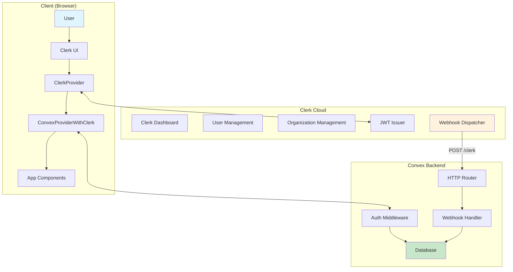

---

## Provider Hierarchy

The provider hierarchy is critical for proper authentication flow. Order matters!

### Why Provider Order Matters

Providers in React wrap around your app like layers of an onion. Each layer depends on the one outside it:

1. **ThemeProvider** (outermost) - Handles dark/light mode. Everything needs to know the theme.
2. **ClerkProvider** - Manages user sessions and authentication state. Must be outside Convex so Convex can use auth info.
3. **ConvexProviderWithClerk** - Connects Convex to Clerk's auth. Uses `useAuth` from Clerk to get JWT tokens.
4. **LiveblocksProvider** - Handles real-time collaboration. Needs user info from Clerk.
5. **StoreUserEffect** - A component that syncs the logged-in user to Convex database.

**If you get the order wrong**, components won't have access to the data they need!

### File: `app/layout.tsx`

```tsx
<ThemeProvider>
  <ConvexClientProvider>      {/* Wraps ClerkProvider + ConvexProviderWithClerk */}
    <LiveblocksProvider>
      <StoreUserEffect />      {/* Client-side user sync */}
      {children}
    </LiveblocksProvider>
  </ConvexClientProvider>
</ThemeProvider>
```

### Detailed Provider Flow

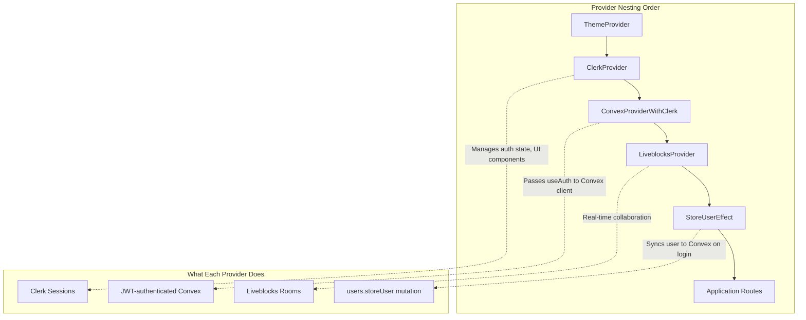

### File: `providers/convex-client-provider.tsx`

```tsx
export const ConvexClientProvider = ({ children }) => {
  return (
    <ClerkProvider appearance={...}>
      <ConvexProviderWithClerk useAuth={useAuth} client={convex}>
        <AuthLoading>
          <LoadingScreen />
        </AuthLoading>
        {children}
      </ConvexProviderWithClerk>
    </ClerkProvider>
  );
};
```

**Key Point**: `ConvexProviderWithClerk` receives the `useAuth` hook from Clerk, allowing Convex to automatically attach JWT tokens to all requests.

---

## JWT Token Flow

Clerk issues JWTs that Convex validates. The JWT contains user identity and organization context.

### What is a JWT?

A **JWT (JSON Web Token)** is like a digitally signed ID card:

- It contains information about who you are (user ID, name, email)
- It's cryptographically signed by Clerk, so no one can fake it
- It has an expiration time, so stolen tokens become useless
- It includes your current organization context (which workspace you're in)

### The Token Journey (Step by Step)

1. **User logs in** → Clerk creates a session and issues a JWT
2. **User makes a request** → The Convex client automatically attaches the JWT
3. **Convex receives request** → It validates the JWT signature using Clerk's public key
4. **Signature valid?** → Convex extracts user info and processes the request
5. **Signature invalid?** → Request is rejected with "Not authenticated"

### JWT Token Structure

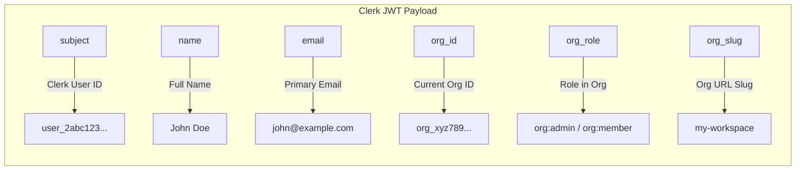

### How JWT Flows Through the System

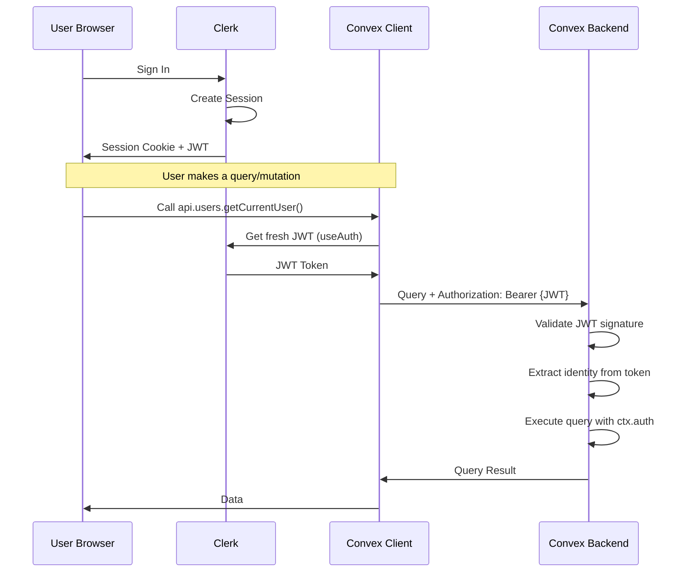

### Convex Auth Configuration

**File: `convex/auth.config.ts`**

```typescript
export default {
  providers: [
    {
      domain: process.env.CLERK_JWT_ISSUER_DOMAIN!,
      applicationID: 'convex',
    },
  ],
}
```

**Required Environment Variable:**
- `CLERK_JWT_ISSUER_DOMAIN`: Your Clerk instance domain (e.g., `https://your-app.clerk.accounts.dev`)

### Accessing Identity in Convex

```typescript
// In any query or mutation:
const identity = await ctx.auth.getUserIdentity();

if (!identity) {
  throw new Error("Not authenticated");
}

// Standard claims
const userId = identity.subject;      // Clerk User ID
const name = identity.name;           // User's full name
const email = identity.email;         // User's email

// Organization claims (from JWT template)
const orgId = (identity as any).org_id;
const orgRole = (identity as any).org_role;
const orgSlug = (identity as any).org_slug;
```

---

## Webhook System

Webhooks are the server-side mechanism for keeping Convex in sync with Clerk changes.

### What is a Webhook?

A **webhook** is like a notification system:

- Instead of constantly asking "Did anything change?" (polling), Clerk just tells you when something happens
- It's a POST request that Clerk sends to your server whenever an event occurs
- Think of it like a doorbell - you don't keep checking if someone's at the door, the doorbell tells you

### Why Do We Need Webhooks?

Client-side sync (`StoreUserEffect`) has limitations:

- What if a user changes their email on a different device?
- What if an admin removes a user from Clerk dashboard?
- What if a user deletes their account without logging in to your app?

**Webhooks solve this** by pushing ALL changes from Clerk to Convex, regardless of where they originated.

### The Webhook Journey (Step by Step)

1. **Something changes in Clerk** (user signs up, org created, user deleted, etc.)
2. **Clerk packages the event** into a JSON payload with all the details
3. **Clerk signs the payload** using your webhook secret (HMAC signature via Svix)
4. **Clerk POSTs to your endpoint** (`/clerk` route in Convex)
5. **Convex receives the request** and extracts the Svix headers
6. **Convex verifies the signature** - if it doesn't match, reject (could be an attacker!)
7. **Signature valid?** → Parse the event type and route to the appropriate handler
8. **Handler updates database** → User created? Insert into `users` table. Org deleted? Cascade delete everything.

### Webhook Architecture

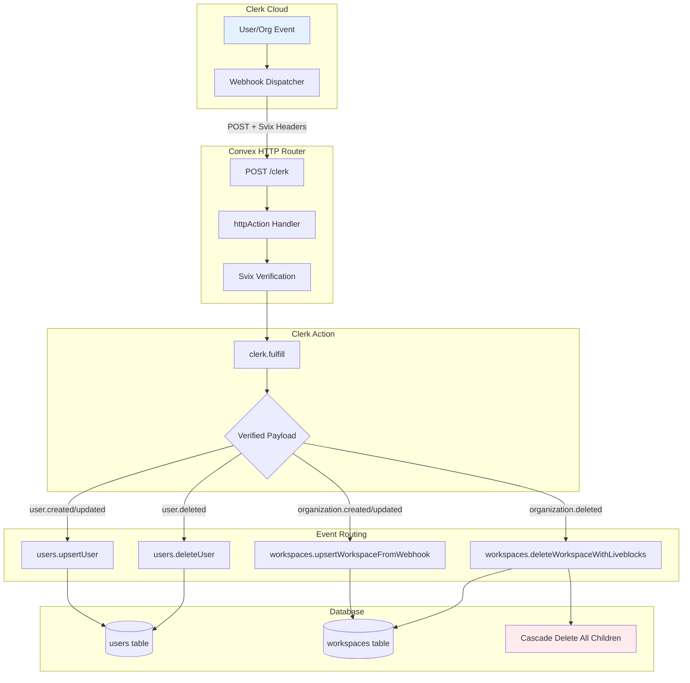

### Webhook Security: Svix Verification

Clerk uses [Svix](https://www.svix.com/) for secure webhook delivery.

#### Why Verification Matters

Anyone who knows your webhook URL could try to send fake requests:
- An attacker could pretend to delete all your users
- A malicious actor could inject fake user data

**Svix verification prevents this** by requiring a secret signature that only Clerk knows.

#### How Verification Works

1. Clerk takes the payload + timestamp + your webhook secret
2. It creates a cryptographic hash (HMAC-SHA256)
3. This hash is sent in the `svix-signature` header
4. Your server recreates the hash using the same inputs
5. If the hashes match → the request is authentic
6. If they don't match → someone is trying to trick you, reject the request!

Every webhook includes:

| Header | Purpose |
|--------|---------|
| `svix-id` | Unique message identifier |
| `svix-timestamp` | Unix timestamp of dispatch |
| `svix-signature` | HMAC signature for verification |

**File: `convex/clerk.ts`**

```typescript
"use node"; // Required for Svix library

import { Webhook } from "svix";

export const fulfill = internalAction({
  args: {
    payload: v.string(),
    headers: v.object({
      svixId: v.string(),
      svixTimestamp: v.string(),
      svixSignature: v.string(),
    }),
  },
  handler: async (ctx, args) => {
    const wh = new Webhook(process.env.CLERK_WEBHOOK_SECRET!);

    // Throws if signature is invalid
    const payload = wh.verify(args.payload, {
      "svix-id": args.headers.svixId,
      "svix-timestamp": args.headers.svixTimestamp,
      "svix-signature": args.headers.svixSignature,
    });

    return payload; // Verified webhook data
  },
});
```

### Webhook Event Types

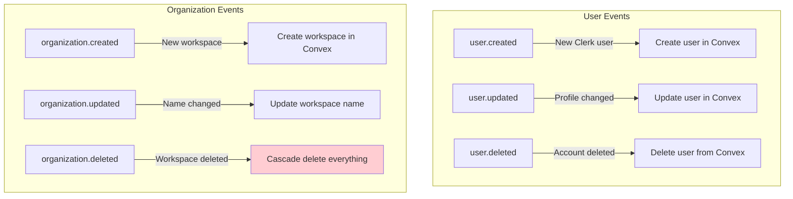

---

## Data Synchronization

### Dual-Sync Strategy

VBase uses two complementary sync mechanisms that work together:

#### Method 1: Client-Side Sync (Fast but Limited)

**When it runs:** Every time a user logs in, `StoreUserEffect` component triggers.

**What it does:**
1. Checks if user exists in Convex database
2. If not → creates a new user record
3. If yes → updates name/email if changed

**Pros:** Instant! User can start using the app immediately.

**Cons:** Only runs when user logs in. Misses changes made elsewhere.

#### Method 2: Webhook Sync (Reliable but Slight Delay)

**When it runs:** Whenever Clerk fires an event (user created, updated, deleted, etc.)

**What it does:**
1. Receives the event from Clerk
2. Verifies it's authentic (Svix signature)
3. Updates the database with the authoritative data

**Pros:** Never misses an event. Catches changes from dashboard, other devices, etc.

**Cons:** Takes a few seconds to propagate.

#### Why Use Both?

| Scenario | Client-Side | Webhook |
|----------|-------------|----------|
| User signs up and immediately uses app | ✅ Handles it | ✅ Also fires (backup) |
| Admin changes user's name in Clerk dashboard | ❌ Won't know | ✅ Catches it |
| User deletes account from settings | ✅ If logged in | ✅ Always catches it |
| Network issues during login | ❌ Might fail | ✅ Will sync eventually |

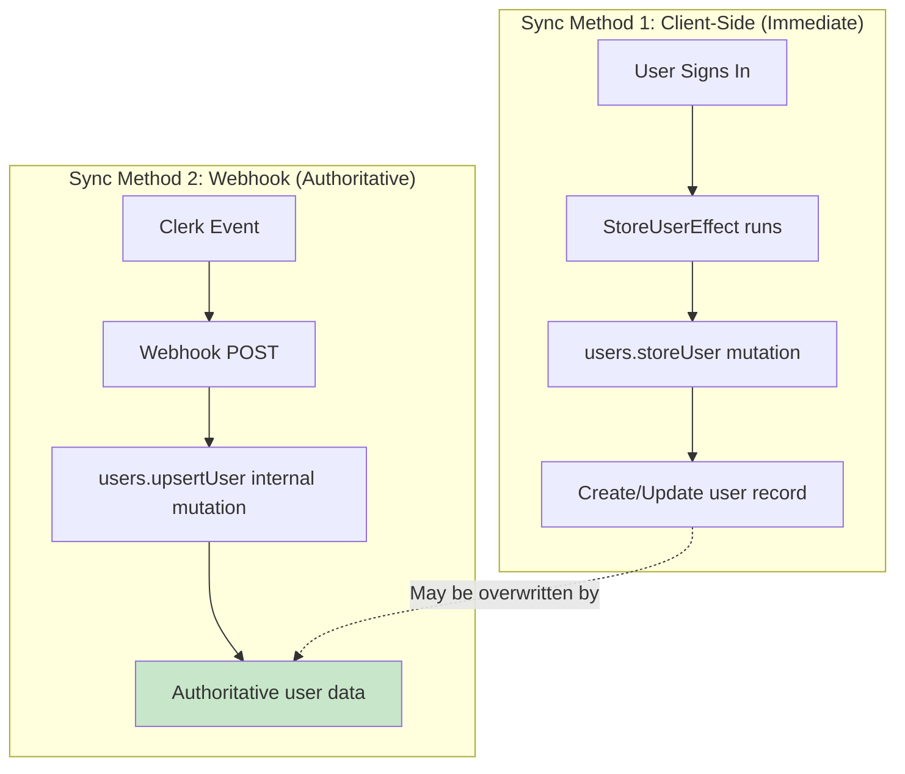

### Why Both Methods?

| Method | Pros | Cons |
|--------|------|------|
| **Client-Side** | Instant sync on login | Can miss offline changes |
| **Webhooks** | Never misses an event | Slight delay (seconds) |

**Result**: Users get immediate access, while webhooks ensure data integrity.

---

## User Lifecycle

### Understanding the User Journey

A user goes through several stages in VBase, and both Clerk and Convex need to stay in sync at each stage:

#### Stage 1: Sign Up
1. User fills out the sign-up form (handled by Clerk UI components)
2. Clerk validates the email, creates the account
3. Clerk fires a `user.created` webhook to Convex
4. Convex creates a matching record in the `users` table
5. User is now known to both systems!

#### Stage 2: Sign In
1. User enters credentials
2. Clerk validates and creates a session
3. Clerk issues a JWT token
4. `StoreUserEffect` runs and calls `users.storeUser`
5. Convex creates/updates the user record (belt AND suspenders!)

#### Stage 3: Profile Updates
1. User changes their name or email in Clerk
2. Clerk updates its records
3. Clerk fires a `user.updated` webhook
4. Convex receives it and updates the `users` table
5. Next time user's name appears in the app, it's up to date!

#### Stage 4: Account Deletion
1. User deletes their account in Clerk
2. Clerk fires a `user.deleted` webhook
3. Convex receives it and removes the user from `users` table
4. User is gone from both systems

### Complete User Flow

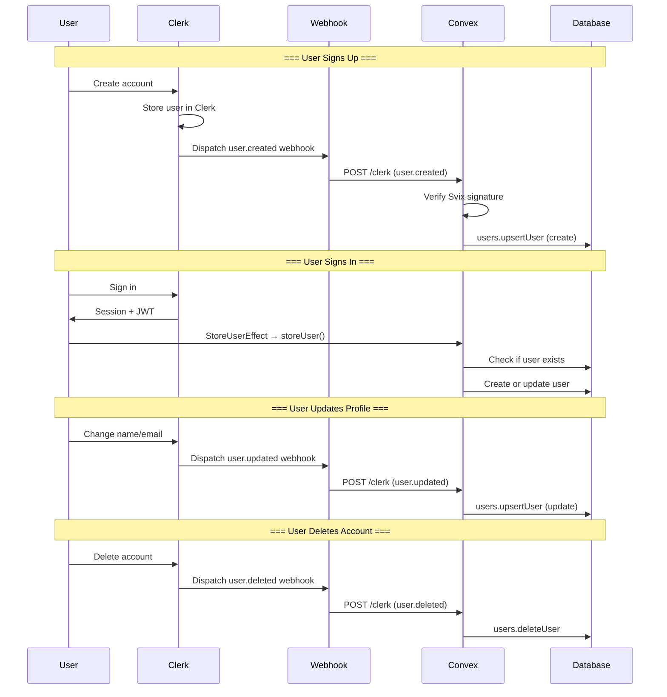

### User Table Schema

```typescript
// convex/schema.ts
users: defineTable({
  clerkId: v.string(),    // Clerk User ID (primary key)
  name: v.string(),       // Full name
  email: v.string(),      // Primary email
}).index("by_clerk_id", ["clerkId"]),
```

---

## Organization (Workspace) Lifecycle

### Understanding Organizations in VBase

Clerk has a built-in **Organizations** feature that VBase leverages for workspaces:

- Every **Clerk Organization** = One **VBase Workspace**
- Organization members automatically get workspace access
- Organization roles (`org:admin`, `org:member`) map to permissions
- When an org is deleted in Clerk, the entire workspace and all its contents are cleaned up

#### Why Use Clerk Organizations?

1. **Invitation system** - Clerk handles invite emails, acceptance, etc.
2. **Role management** - Admins vs members is built-in
3. **SSO support** - Enterprise orgs can use their own identity provider
4. **Billing integration** - Per-org billing is straightforward
5. **No extra code** - We don't need to build our own team management!

### Clerk Organizations = VBase Workspaces

VBase maps Clerk Organizations 1:1 to Workspaces:

| Clerk Concept | VBase Concept |
|---------------|---------------|
| Organization | Workspace |
| org:admin | Workspace Owner |
| org:member | Workspace Member |
| Organization ID | clerkOrgId foreign key |

### Workspace Creation Flow

#### What Happens When You Create a Workspace

1. **User clicks "Create Workspace"** in VBase UI
2. **Clerk's `<CreateOrganization />` component** handles the form
3. **Clerk creates the organization** and stores it
4. **Clerk fires `organization.created` webhook** to Convex
5. **Convex receives the webhook** with org ID, name, and creator's user ID
6. **`upsertWorkspaceFromWebhook` runs** and creates the workspace record
7. **A `#general` channel is automatically created** for workspace chat
8. **User can now access their new workspace!**

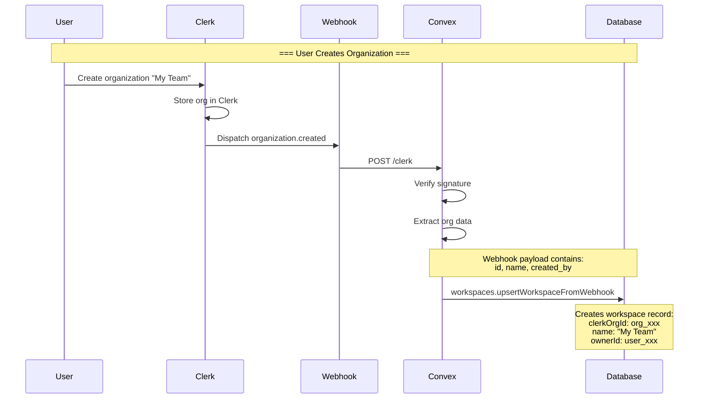

### Workspace Deletion Flow (Cascade Delete)

When a Clerk organization is deleted, VBase must clean up all related data.

#### Why Cascade Delete is Critical

A workspace contains LOTS of related data:
- Chat channels and messages
- Rooms (document, code, whiteboard, conference)
- Documents, code files, whiteboards inside those rooms
- Meetings and their recordings
- Liveblocks real-time rooms (external service!)

If we just delete the workspace record, all this data becomes **orphaned** - it still exists but belongs to nothing. This wastes storage and could cause bugs.

#### The Cascade Delete Process (Step by Step)

1. **Webhook arrives** - `organization.deleted` event from Clerk
2. **Find the workspace** - Look up by `clerkOrgId`
3. **Delete all channels** - But first, for each channel:
   - Delete all messages in that channel
   - Delete all read receipts (`lastRead`) for that channel
   - Then delete the channel itself
4. **Delete all rooms** - But first, for each room:
   - Delete all documents (and note their Liveblocks room IDs)
   - Delete all code files (and note their Liveblocks room IDs)
   - Delete all whiteboards (and note their Liveblocks room IDs)
   - Delete all meetings
   - Note the room's own Liveblocks presence room ID
   - Then delete the room itself
5. **Delete the workspace record**
6. **Clean up Liveblocks** - Call Liveblocks API to delete each collected room ID

#### Why Liveblocks Cleanup is Separate

Convex mutations can't make external HTTP calls directly. So we:
1. Run a **mutation** to delete Convex data (returns list of Liveblocks room IDs)
2. Run an **action** to call Liveblocks API and delete those rooms

This is why we use `deleteWorkspaceWithLiveblocks` (an action that orchestrates both).

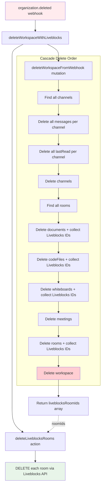

### Collected Liveblocks Room IDs

The cascade delete collects room IDs in these patterns:

| Content Type | Liveblocks Room ID Pattern | What It Contains |
|--------------|---------------------------|------------------|
| Documents | `doc:{documentId}` | Real-time Tiptap editor state (Yjs) |
| Code Files | `code:{fileId}` | Real-time CodeMirror state (Yjs) |
| Whiteboards | `whiteboard:{whiteboardId}` | Excalidraw drawing elements |
| Room Presence | `room:{roomId}` | Who's currently in the room, cursor positions |

#### Why We Need to Delete Liveblocks Rooms

1. **Storage costs** - Liveblocks charges based on stored data
2. **Privacy** - Old content shouldn't linger in a third-party service
3. **Clean state** - If workspace is recreated, we don't want old data appearing

---

## Code Reference

### How to Read the Code

If you want to trace through the integration yourself, here's the reading order:

1. **Start with `convex/auth.config.ts`** - This tells Convex how to validate JWTs from Clerk
2. **Read `providers/convex-client-provider.tsx`** - See how Clerk and Convex providers are wired together
3. **Check `components/StoreUserEffect.tsx`** - Simple component that syncs user on login
4. **Examine `convex/http.ts`** - The webhook entry point, see how events are routed
5. **Look at `convex/clerk.ts`** - The Svix verification logic
6. **Study `convex/users.ts`** - User CRUD, both client-callable and internal webhook mutations
7. **Dive into `convex/workspaces.ts`** - Workspace logic including the cascade delete

### Key Files

| File | Purpose |
|------|---------|
| `convex/auth.config.ts` | Clerk JWT validation config |
| `convex/http.ts` | Webhook HTTP router |
| `convex/clerk.ts` | Svix signature verification |
| `convex/users.ts` | User CRUD operations |
| `convex/workspaces.ts` | Workspace CRUD + cascade delete |
| `providers/convex-client-provider.tsx` | Client-side provider setup |
| `components/StoreUserEffect.tsx` | Client-side user sync |

### Environment Variables

```env
# Convex
CONVEX_DEPLOYMENT=<deployment-id>
NEXT_PUBLIC_CONVEX_URL=https://<deployment>.convex.cloud

# Clerk
NEXT_PUBLIC_CLERK_PUBLISHABLE_KEY=pk_test_...
CLERK_SECRET_KEY=sk_test_...
CLERK_JWT_ISSUER_DOMAIN=https://<your-app>.clerk.accounts.dev
CLERK_WEBHOOK_SECRET=whsec_...

# Liveblocks (for cascade delete)
LIVEBLOCKS_SECRET_KEY=sk_...
```

### Clerk Dashboard Configuration

#### Setting Up the Integration (For New Projects)

If you're setting this up from scratch, follow these steps:

**Step 1: Create a Clerk Application**
- Go to [clerk.com](https://clerk.com) and create a new application
- Enable "Organizations" in the settings (this is required for workspaces)

**Step 2: Configure JWT Template**
- Go to **JWT Templates** in Clerk Dashboard
- Create a new template named **"convex"**
- Add organization claims so Convex knows which workspace the user is in

**Step 3: Set Up Webhook Endpoint**
- Go to **Webhooks** in Clerk Dashboard
- Add your Convex HTTP endpoint
- Select the events you want to receive
- Copy the signing secret to your environment variables

**Step 4: Configure Environment Variables**
- Add all required env vars to your `.env.local` and Convex dashboard

1. **JWT Templates**: Create a template named "convex" with these claims:
   ```json
   {
     "org_id": "{{org.id}}",
     "org_role": "{{org.role}}",
     "org_slug": "{{org.slug}}"
   }
   ```

2. **Webhooks**: Configure endpoint:
   - URL: `https://<your-convex-deployment>.convex.site/clerk`
   - Events: `user.created`, `user.updated`, `user.deleted`, `organization.created`, `organization.updated`, `organization.deleted`

---

## Summary

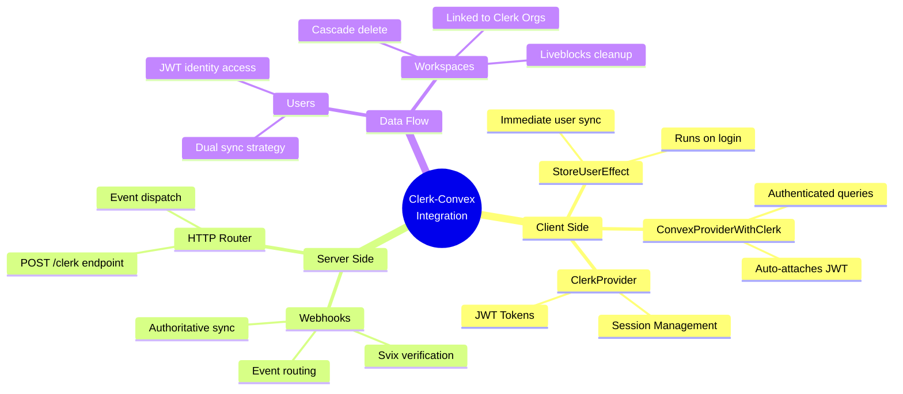

### Key Takeaways

1. **JWT for Client Auth**: Clerk issues tokens, Convex validates them. Every request from the browser includes a signed token that proves who the user is.

2. **Webhooks for Server Sync**: Clerk pushes changes, Convex persists them. This catches all changes, even those made outside your app.

3. **Dual Sync Strategy**: Client-side for speed, webhooks for reliability. Users get instant access, while webhooks ensure nothing is missed.

4. **Cascade Delete**: Organization deletion triggers full cleanup. We don't leave orphaned data - everything related to a workspace is removed.

5. **Liveblocks Integration**: Real-time room cleanup on workspace delete. External Liveblocks rooms are also deleted via API calls.

### Common Gotchas & Debugging Tips

| Issue | Likely Cause | How to Fix |
|-------|-------------|------------|
| "Not authenticated" errors | JWT not being attached | Check that `ConvexProviderWithClerk` is set up correctly |
| User exists in Clerk but not Convex | Webhook not firing | Check webhook URL and signing secret |
| Webhook returns 400 error | Signature verification failed | Verify `CLERK_WEBHOOK_SECRET` matches Clerk dashboard |
| Old data after profile update | Client cache | Data should update on next page load or use `useQuery` |
| Workspace deletion incomplete | Action failed | Check Convex logs for Liveblocks API errors |

---

*Last updated: January 2026*
