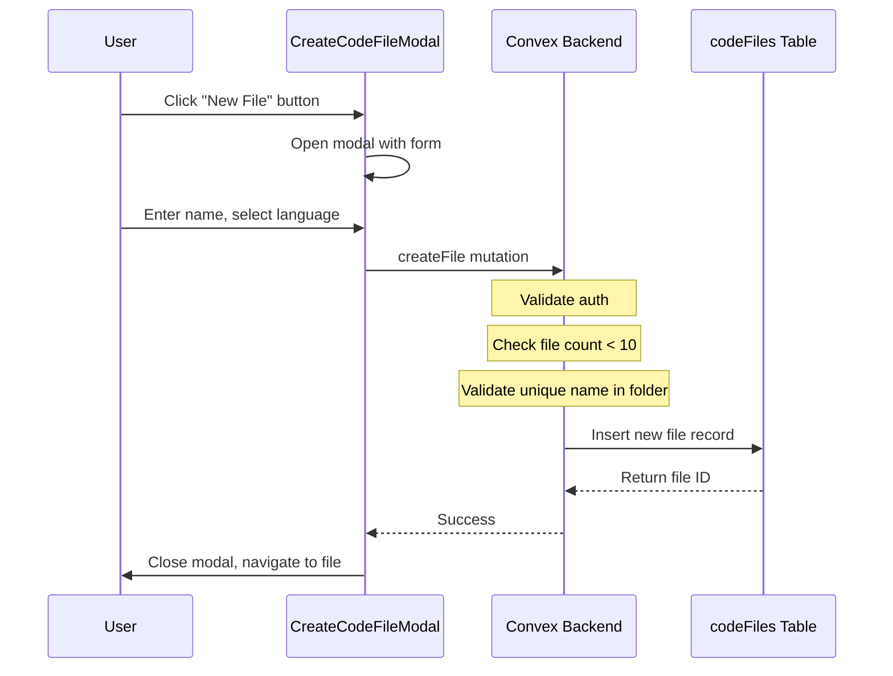
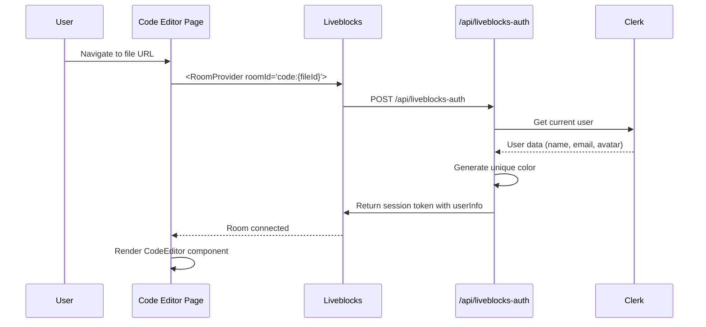
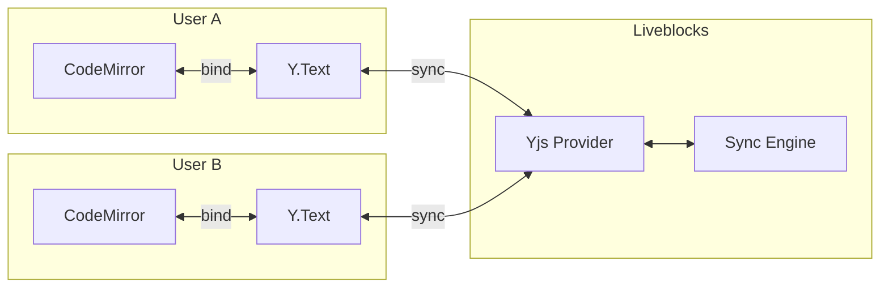
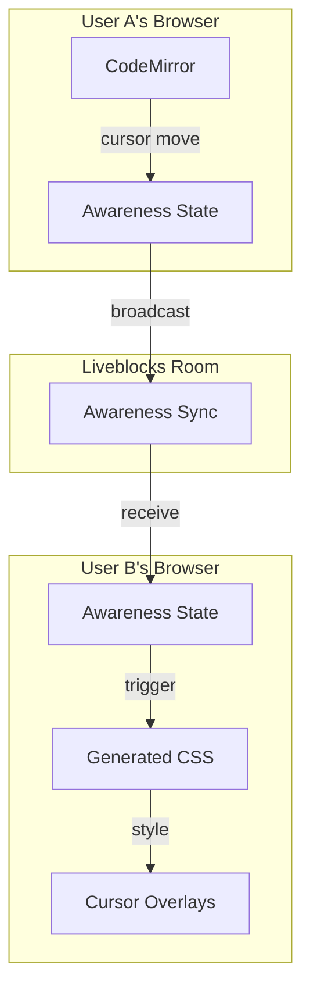
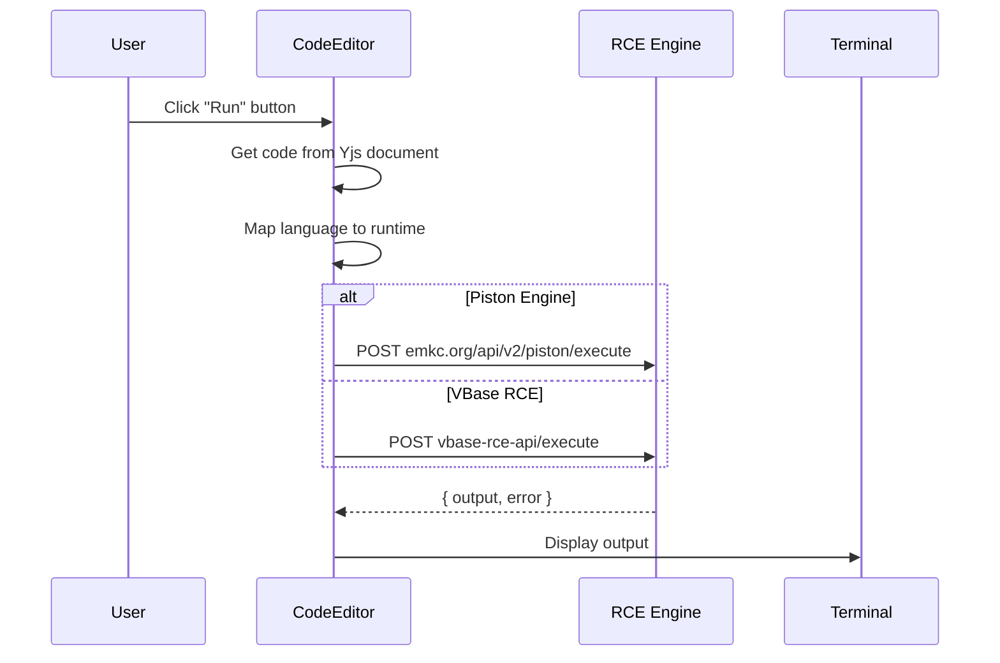

# Code Room Feature Documentation

This document provides a comprehensive guide to the **Code Room** feature in VBase—a real-time collaborative code editing environment with multi-user presence, cursor tracking, and dual code execution engines.

---

## Table of Contents

1. [Overview](#overview)
2. [Architecture](#architecture)
3. [File & Folder System](#file--folder-system)
4. [Joining a Code Room](#joining-a-code-room)
5. [Real-Time Collaboration](#real-time-collaboration)
6. [Cursor Presence & User Names](#cursor-presence--user-names)
7. [Code Execution](#code-execution)
8. [Key Components Reference](#key-components-reference)

---

## Overview

The Code Room is a collaborative code editor that allows multiple users to:

- Create and organize files/folders in a hierarchical structure
- Edit code files simultaneously with real-time synchronization
- See other users' cursor positions with their names displayed above the cursor
- Execute code using two available engines (Piston or VBase RCE)
- View output in an integrated terminal panel

### Technology Stack

| Layer | Technology | Purpose |
|-------|------------|---------|
| Editor | CodeMirror 6 | Modern code editor with extensions |
| Real-time Sync | Yjs (CRDT) | Conflict-free text synchronization |
| Collaboration | Liveblocks | Yjs provider + presence awareness |
| Database | Convex | File/folder metadata persistence |
| Code Execution | Piston / VBase RCE | Remote code execution |

---

## Architecture

### High-Level Data Flow

```mermaid
flowchart TB
    subgraph Client["Client (Browser)"]
        FE[File Explorer]
        CE[CodeMirror Editor]
        YJS[Yjs Document]
        AWR[Awareness State]
    end

    subgraph Liveblocks["Liveblocks Cloud"]
        Room[Room: code:{fileId}]
        Storage[Yjs Storage]
        Presence[Presence/Awareness]
    end

    subgraph Convex["Convex Backend"]
        CF[codeFiles Table]
    end

    subgraph RCE["Code Execution"]
        Piston[Piston API]
        VBase[VBase RCE]
    end

    FE -->|Create/Delete Files| CF
    FE -->|Navigate to File| CE
    CE <-->|Bind| YJS
    YJS <-->|Sync via Provider| Storage
    AWR <-->|Broadcast| Presence
    CE -->|Run Code| Piston
    CE -->|Run Code| VBase
```

### Step-by-Step Explanation

**Why this architecture?**
- **Convex** stores the "what files exist" metadata (names, languages, folder structure)
- **Liveblocks + Yjs** stores the "what's inside each file" (actual code content) and syncs it in real-time
- **Separation of concerns**: File structure is persistent data; file contents need CRDT-based real-time sync

**How it works:**
1. User opens File Explorer → Convex query fetches file list
2. User clicks a file → Navigates to code editor page
3. Code editor page creates a Liveblocks Room with ID `code:{fileId}`
4. Yjs document binds to CodeMirror → All edits sync automatically
5. User awareness (cursor position, name) broadcasts to all participants
6. When user runs code → Content sent to RCE engine → Output displayed in terminal

---

## File & Folder System

### Schema Definition

Files and folders are stored in the `codeFiles` table in Convex:

```typescript
// convex/schema.ts
codeFiles: defineTable({
  workspaceId: v.id("workspaces"),
  roomId: v.id("rooms"),
  name: v.string(),
  type: v.union(v.literal("file"), v.literal("folder")),
  language: v.optional(v.string()),          // Only for files
  parentId: v.optional(v.id("codeFiles")),   // null = root level
  createdBy: v.string(),                     // Clerk user ID
  createdAt: v.number(),
  lastEditedAt: v.optional(v.number()),
  lastEditedBy: v.optional(v.string()),
})
  .index("by_room", ["roomId"])
  .index("by_parent", ["parentId"])
```

### Constraints

| Constraint | Limit |
|------------|-------|
| Files per Room | **10 max** |
| Folder nesting | Unlimited (hierarchical via `parentId`) |

### File Creation Flow



#### In Easy Words

1. **User clicks "New File"** → A modal pops up asking for filename and language
2. **User fills the form** → Selects language from dropdown (JavaScript, Python, Java, C, C++)
3. **Form submits** → Calls `createFile` mutation in Convex
4. **Backend validates**:
   - Is the user authenticated? (Check Clerk identity)
   - Is the file count under 10? (Enforced limit)
   - Is the filename unique in this folder? (No duplicates)
5. **File record created** → Stored in `codeFiles` table with metadata
6. **User navigated to editor** → Opens the new file in CodeMirror

### Folder Creation Flow

Folders work similarly but:
- No `language` field (only files have languages)
- Folders can contain files and other folders
- Folders are rendered with expand/collapse UI in File Explorer

```typescript
// convex/codeFiles.ts - createFolder mutation
export const createFolder = mutation({
  args: {
    roomId: v.id("rooms"),
    name: v.string(),
    parentId: v.optional(v.id("codeFiles")),
  },
  handler: async (ctx, args) => {
    // ... validation ...

    return await ctx.db.insert("codeFiles", {
      workspaceId: room.workspaceId,
      roomId: args.roomId,
      name: args.name,
      type: "folder",
      parentId: args.parentId,
      createdBy: identity.subject,
      createdAt: Date.now(),
    });
  },
});
```

### Hierarchical Navigation (Breadcrumbs)

When viewing files in a subfolder, breadcrumbs show the path:

```
Root > src > components > Button.tsx
```

The `getBreadcrumbs` query recursively walks up the `parentId` chain:

```typescript
// convex/codeFiles.ts
export const getBreadcrumbs = query({
  args: { nodeId: v.id("codeFiles") },
  handler: async (ctx, args) => {
    const breadcrumbs: Array<{...}> = [];
    let current = await ctx.db.get(args.nodeId);

    while (current) {
      breadcrumbs.unshift({ id: current._id, name: current.name });
      current = current.parentId
        ? await ctx.db.get(current.parentId)
        : null;
    }

    return breadcrumbs;
  },
});
```

---

## Joining a Code Room

### Room ID Pattern

Each code file gets a unique Liveblocks room:

```
code:{fileId}
```

Example: `code:jd71k2m4n5p6q7r8s9t0`

### Page Structure

The code editor page is located at:

```
app/workspace/[workspaceId]/room/[roomId]/code/[fileId]/page.tsx
```

### Join Flow



#### In Easy Words

**What happens when you click a file:**

1. **URL changes** to `/workspace/{id}/room/{roomId}/code/{fileId}`
2. **Page loads** and wraps everything in a `RoomProvider`
3. **Liveblocks authenticates** by calling `/api/liveblocks-auth`
4. **Auth endpoint**:
   - Gets your Clerk user info (name, profile picture)
   - Generates a unique color for your cursor (based on user ID hash)
   - Returns a Liveblocks token with your identity
5. **Room connected** → You're now "in" the collaborative session
6. **CodeEditor renders** → You see the code and other users' cursors

### Authentication Endpoint

```typescript
// app/api/liveblocks-auth/route.ts
export async function POST(request: Request) {
  const user = await currentUser();
  if (!user) return new Response("Unauthorized", { status: 401 });

  const { room } = await request.json();

  const session = liveblocks.prepareSession(user.id, {
    userInfo: {
      name: user.firstName || user.emailAddresses[0].emailAddress,
      email: user.emailAddresses[0].emailAddress,
      avatar: user.imageUrl,
      color: getUserColor(user.id),  // Deterministic color from ID
    },
  });

  session.allow(room, session.FULL_ACCESS);
  const { body, status } = await session.authorize();
  return new Response(body, { status });
}
```

### User Color Generation

Each user gets a consistent color based on their ID:

```typescript
function getUserColor(userId: string): string {
  const colors = [
    "#E57373", "#F06292", "#BA68C8", "#9575CD",
    "#7986CB", "#64B5F6", "#4FC3F7", "#4DD0E1",
    "#4DB6AC", "#81C784", "#AED581", "#DCE775",
    "#FFF176", "#FFD54F", "#FFB74D", "#FF8A65",
  ];

  // Hash the user ID to get a consistent index
  let hash = 0;
  for (let i = 0; i < userId.length; i++) {
    hash = userId.charCodeAt(i) + ((hash << 5) - hash);
  }

  return colors[Math.abs(hash) % colors.length];
}
```

**Why?** So every time the same user joins, they always get the same cursor color. This makes it easy to recognize who's who.

---

## Real-Time Collaboration

### Yjs + CodeMirror Integration

The magic of real-time collaboration happens through **Yjs**—a CRDT (Conflict-free Replicated Data Type) library that handles concurrent edits without conflicts.



### Editor Setup

```typescript
// components/code/code-editor.tsx
export function CodeEditor({ file, onBack }: CodeEditorProps) {
  const room = useRoom();
  const { userInfo } = useSelf((me) => me);

  useEffect(() => {
    // 1. Get Yjs provider (singleton per room)
    const provider = getYjsProviderForRoom(room);

    // 2. Create Yjs document and text type
    const ydoc = provider.getYDoc();
    const ytext = ydoc.getText("codemirror");

    // 3. Set up undo manager (user-specific undo/redo)
    const undoManager = new Y.UndoManager(ytext);

    // 4. Set user awareness (cursor info)
    provider.awareness.setLocalStateField("user", {
      name: userInfo?.name || "Anonymous",
      color: userInfo?.color || "#888888",
      colorLight: lightenColor(userInfo?.color, 0.3),
    });

    // 5. Create editor with yCollab extension
    const editor = new EditorView({
      parent: containerRef.current,
      state: EditorState.create({
        doc: ytext.toString(),
        extensions: [
          // ... other extensions ...
          yCollab(ytext, provider.awareness, { undoManager }),
        ],
      }),
    });
  }, [room, userInfo]);
}
```

### Step-by-Step: How Edits Sync

1. **User A types "hello"** in their editor
2. **CodeMirror** updates the bound `Y.Text` object
3. **Yjs** creates an "operation" describing the change
4. **Liveblocks provider** broadcasts the operation to all room participants
5. **User B's Yjs** receives the operation and applies it
6. **User B's CodeMirror** automatically updates to show "hello"

**The beauty of CRDTs:** If User A and User B type at the same position simultaneously, Yjs automatically resolves the conflict in a deterministic way—no data loss, no conflicts.

### Singleton Yjs Provider

To prevent multiple providers from fighting over the same room:

```typescript
// This pattern ensures one provider per room
function getYjsProviderForRoom(room: Room): YjsProvider {
  if (!providerCache.has(room.id)) {
    providerCache.set(room.id, createLiveblocksYjsProvider(room));
  }
  return providerCache.get(room.id);
}
```

---

## Cursor Presence & User Names

### How Cursor Tracking Works



### Awareness State Structure

Each user's awareness contains:

```typescript
{
  user: {
    name: "John Doe",
    color: "#E57373",      // Cursor/selection color
    colorLight: "#F5A3A3", // Selection background (lighter)
  }
}
```

### The Cursors Component

The `Cursors` component listens to awareness changes and generates CSS:

```typescript
// components/code/cursors.tsx
export function Cursors({ yProvider }: CursorsProps) {
  const [awarenessUsers, setAwarenessUsers] = useState<Map<number, AwarenessUser>>(new Map());

  useEffect(() => {
    const updateUsers = () => {
      const states = yProvider.awareness.getStates();
      const usersMap = new Map<number, AwarenessUser>();

      states.forEach((state, clientId) => {
        if (clientId !== yProvider.awareness.clientID && state.user) {
          usersMap.set(clientId, state.user);
        }
      });

      setAwarenessUsers(usersMap);
    };

    yProvider.awareness.on("change", updateUsers);
    return () => yProvider.awareness.off("change", updateUsers);
  }, [yProvider]);

  // Generate CSS for each remote user
  const cursorStyles = useMemo(() => {
    let css = "";
    awarenessUsers.forEach((user, clientId) => {
      css += `
        .yRemoteSelection-${clientId} {
          background-color: ${user.colorLight};
        }
        .yRemoteSelectionHead-${clientId} {
          border-left: 2px solid ${user.color};
          border-top: 2px solid ${user.color};
        }
        .yRemoteSelectionHead-${clientId}::after {
          content: "${user.name}";
          background-color: ${user.color};
          color: white;
          /* ... positioning styles ... */
        }
      `;
    });
    return css;
  }, [awarenessUsers]);

  return <style>{cursorStyles}</style>;
}
```

### Visual Result

When User B is editing, User A sees:

```
┌─────────────────────────────────────┐
│ function hello() {                  │
│   console.log("Hi│");  ← User B     │  ← Colored cursor with name label
│ }                    └──────────┘   │
└─────────────────────────────────────┘
```

- **Cursor line**: Colored vertical bar (User B's color)
- **Name label**: Floating above cursor showing "User B"
- **Selection highlight**: If User B selects text, it shows in their light color

### Active Users Avatars

At the top of the editor, users see who's in the room:

```typescript
// components/liveblocks/active-users.tsx
export function ActiveUsersAvatars() {
  const others = useOthers();  // Other users in room
  const self = useSelf();      // Current user

  const allUsers = [
    ...(self ? [{ id: self.id, name: self.info?.name, isSelf: true }] : []),
    ...others.map((other) => ({ id: other.id, name: other.info?.name })),
  ];

  return (
    <div className="flex items-center">
      {allUsers.slice(0, 5).map((user) => (
        <Avatar key={user.id} name={user.name} />
      ))}
      {allUsers.length > 5 && <span>+{allUsers.length - 5}</span>}
      <span>{allUsers.length} editing</span>
    </div>
  );
}
```

---

## Code Execution

### Dual RCE Engine Architecture

VBase supports two code execution engines:

| Engine | Type | Use Case |
|--------|------|----------|
| Piston | Public API | Free, community-hosted |
| VBase RCE | Private API | Custom Azure-hosted |

### Supported Languages

| Language | Piston Version | VBase RCE Version |
|----------|----------------|-------------------|
| JavaScript | 18.15.0 | 18.15.0 |
| Python | 3.10.0 | 3.10.0 |
| Java | 15.0.2 | 15.0.2 |
| C | 10.2.0 | 10.2.0 |
| C++ | 10.2.0 | 10.2.0 |

> **Note:** TypeScript is NOT supported by either engine.

### Execution Flow



### Code Execution Implementation

```typescript
// components/code/code-editor.tsx
const handleRun = async () => {
  setIsRunning(true);
  setTerminalOpen(true);

  const code = editorRef.current?.state.doc.toString() || "";

  try {
    let result;

    if (rceEngine === "piston") {
      result = await runCode(file.language || "javascript", code);
    } else {
      result = await runCodeVbase(file.language || "javascript", code);
    }

    if (result.success && result.data) {
      setOutput(result.data.output);
      setIsError(false);
    } else {
      setOutput(result.error || "Execution failed");
      setIsError(true);
    }
  } catch (error) {
    setOutput("Failed to execute code");
    setIsError(true);
  } finally {
    setIsRunning(false);
  }
};
```

### Piston API Client

```typescript
// lib/piston.ts
const LANGUAGE_MAP: Record<string, LanguageConfig> = {
  javascript: { language: "javascript", version: "18.15.0" },
  python: { language: "python", version: "3.10.0" },
  java: { language: "java", version: "15.0.2" },
  c: { language: "c", version: "10.2.0" },
  cpp: { language: "c++", version: "10.2.0" },
};

export async function runCode(language: string, code: string) {
  const config = LANGUAGE_MAP[language];

  const response = await fetch("https://emkc.org/api/v2/piston/execute", {
    method: "POST",
    headers: { "Content-Type": "application/json" },
    body: JSON.stringify({
      language: config.language,
      version: config.version,
      files: [{ content: code }],
    }),
  });

  const result = await response.json();

  return {
    success: true,
    data: {
      output: result.run?.output || result.compile?.output || "",
    },
  };
}
```

### VBase RCE Client

```typescript
// lib/vbase-rce.ts
export async function runCodeVbase(language: string, code: string) {
  const baseUrl = process.env.NEXT_PUBLIC_VBASE_RCE_BASE_URL;
  const apiSecret = process.env.NEXT_PUBLIC_VBASE_RCE_API_SECRET;

  const response = await fetch(`${baseUrl}/execute`, {
    method: "POST",
    headers: {
      "Content-Type": "application/json",
      "X-API-Key": apiSecret || "",
    },
    body: JSON.stringify({
      language: config.language,
      version: config.version,
      code,
    }),
  });

  // ... similar response handling ...
}
```

### Engine Selector UI

Users can switch between engines via dropdown:

```typescript
// In CodeEditor toolbar
<select
  value={rceEngine}
  onChange={(e) => setRceEngine(e.target.value as "piston" | "vbase")}
>
  <option value="piston">Piston (Public)</option>
  <option value="vbase">VBase RCE</option>
</select>
```

### Terminal Component

Output displays in a VS Code-style terminal panel:

```typescript
// components/code/terminal.tsx
export function Terminal({ isOpen, output, isError, isRunning }) {
  return (
    <motion.div className="absolute bottom-0 left-0 right-0 bg-[#1e1e1e]">
      {isRunning ? (
        <div className="flex items-center gap-2">
          <Loader2 className="animate-spin" />
          <span>Executing...</span>
        </div>
      ) : output ? (
        <pre className={isError ? "text-red-400" : "text-gray-300"}>
          {output}
        </pre>
      ) : (
        <span>Ready. Click Run to execute your code.</span>
      )}
    </motion.div>
  );
}
```

Features:
- Resizable (drag top edge)
- Collapsible (toggle button)
- Color-coded output (red for errors)
- Loading spinner during execution

---

## Key Components Reference

### File Locations

| Component | Path | Purpose |
|-----------|------|---------|
| File Explorer | `components/code/file-explorer.tsx` | File tree navigation |
| Code Editor | `components/code/code-editor.tsx` | Main editor with Yjs |
| Cursors | `components/code/cursors.tsx` | Remote cursor CSS |
| Terminal | `components/code/terminal.tsx` | Output display |
| Create File Modal | `components/code/create-code-file-modal.tsx` | File creation form |
| Active Users | `components/liveblocks/active-users.tsx` | User avatars |

### Convex Functions

| Function | Type | Purpose |
|----------|------|---------|
| `codeFiles.createFile` | Mutation | Create new file |
| `codeFiles.createFolder` | Mutation | Create new folder |
| `codeFiles.getFiles` | Query | List files in room/folder |
| `codeFiles.getFileById` | Query | Get single file details |
| `codeFiles.getBreadcrumbs` | Query | Get folder path |
| `codeFiles.rename` | Mutation | Rename file/folder |
| `codeFiles.deleteNode` | Mutation | Delete file/folder (recursive) |
| `codeFiles.updateLastEdited` | Mutation | Track last edit time/user |

### API Routes

| Route | Method | Purpose |
|-------|--------|---------|
| `/api/liveblocks-auth` | POST | Authenticate Liveblocks session |

### Liveblocks Room ID

Pattern: `code:{fileId}`

Example: `code:jd71k2m4n5p6q7r8s9t0`

---

## Summary

The Code Room feature combines several technologies to create a seamless collaborative coding experience:

1. **Convex** manages file/folder metadata with constraints
2. **Liveblocks + Yjs** handles real-time code synchronization
3. **CodeMirror 6** provides the editing interface
4. **Awareness API** enables cursor presence and user identification
5. **Dual RCE engines** allow code execution with fallback options

The architecture cleanly separates:
- **Persistent data** (file structure) → Convex
- **Ephemeral data** (code content, cursors) → Liveblocks

This separation ensures files are always discoverable in the database while leveraging CRDTs for conflict-free real-time editing.
