# VBase Database Schema & Design

A comprehensive guide to understanding the Convex database schema, table relationships, and data design patterns used in VBase.

---

## Table of Contents

1. [Overview](#overview)
2. [Entity Relationship Diagram](#entity-relationship-diagram)
3. [Tables Reference](#tables-reference)
   - [users](#users-table)
   - [workspaces](#workspaces-table)
   - [rooms](#rooms-table)
   - [channels](#channels-table)
   - [messages](#messages-table)
   - [lastRead](#lastread-table)
   - [documents](#documents-table)
   - [codeFiles](#codefiles-table)
   - [whiteboards](#whiteboards-table)
   - [meetings](#meetings-table)
4. [Relationships Deep Dive](#relationships-deep-dive)
5. [Indexing Strategy](#indexing-strategy)
6. [Design Patterns](#design-patterns)
7. [Constraints & Limits](#constraints--limits)
8. [Data Flow Examples](#data-flow-examples)

---

## Overview

### What is Convex?

Convex is a backend-as-a-service that provides:
- **Real-time database** with automatic sync to clients
- **TypeScript-first** schema definitions
- **Automatic indexing** for efficient queries
- **ACID transactions** for data integrity

### VBase Data Architecture

VBase organizes data in a hierarchical structure:

```
User (Clerk)
 └── Workspace (Clerk Organization)
      ├── Channels (Chat)
      │    └── Messages
      │         └── LastRead (per user)
      └── Rooms
           ├── Documents (in document rooms)
           ├── CodeFiles (in code rooms)
           ├── Whiteboards (in whiteboard rooms)
           └── Meetings (in conference rooms)
```

### Key Design Decisions

| Decision | Rationale |
|----------|-----------|
| **Clerk IDs as foreign keys** | Users/orgs are managed by Clerk, so we reference their IDs |
| **Denormalized workspaceId** | Added to child tables for faster queries without joins |
| **Soft limits enforced in code** | Convex doesn't have DB-level constraints, so limits are checked in mutations |
| **Timestamps as numbers** | JavaScript `Date.now()` returns milliseconds - simple and sortable |

---

## Entity Relationship Diagram

### Full Schema Overview


### Simplified View (Core Relationships)


---

## Tables Reference

### users Table

**Purpose:** Store user information synced from Clerk.

**Schema Definition:**
```typescript
users: defineTable({
  clerkId: v.string(),    // Clerk User ID (e.g., "user_2abc123...")
  name: v.string(),       // Full name
  email: v.string(),      // Primary email address
}).index("by_clerk_id", ["clerkId"])
```

**Fields Explained:**

| Field | Type | Description | Example |
|-------|------|-------------|---------|
| `_id` | `Id<"users">` | Auto-generated Convex document ID | `"jd72kf9s..."` |
| `clerkId` | `string` | Unique Clerk user identifier | `"user_2NfG7..."` |
| `name` | `string` | User's display name | `"John Doe"` |
| `email` | `string` | User's primary email | `"john@example.com"` |

**How It's Populated:**

1. **Via Webhook** (authoritative): When Clerk fires `user.created` or `user.updated`
2. **Via Client** (immediate): When user logs in, `StoreUserEffect` calls `storeUser`

**Usage Pattern:**
```typescript
// Look up user by Clerk ID
const user = await ctx.db
  .query("users")
  .withIndex("by_clerk_id", (q) => q.eq("clerkId", clerkId))
  .unique();
```

---

### workspaces Table

**Purpose:** Represent team workspaces, linked 1:1 with Clerk Organizations.

**Schema Definition:**
```typescript
workspaces: defineTable({
  clerkOrgId: v.string(),  // Clerk Organization ID
  name: v.string(),        // Workspace display name
  ownerId: v.string(),     // Clerk User ID of creator/owner
})
  .index("by_clerk_org", ["clerkOrgId"])
  .index("by_owner", ["ownerId"])
```

**Fields Explained:**

| Field | Type | Description | Example |
|-------|------|-------------|---------|
| `_id` | `Id<"workspaces">` | Convex document ID | `"ks82nf3..."` |
| `clerkOrgId` | `string` | Links to Clerk Organization | `"org_xyz789..."` |
| `name` | `string` | Workspace name | `"Acme Corp Dev Team"` |
| `ownerId` | `string` | Clerk ID of the owner | `"user_2NfG7..."` |

**Relationships:**


**How It's Created:**

1. User creates organization in Clerk UI
2. Clerk fires `organization.created` webhook
3. `upsertWorkspaceFromWebhook` creates the workspace record
4. A `#general` channel is automatically created

---

### rooms Table

**Purpose:** Container for different collaboration spaces within a workspace.

**Schema Definition:**
```typescript
rooms: defineTable({
  workspaceId: v.id("workspaces"),  // Parent workspace
  name: v.string(),                  // Room display name
  type: v.union(
    v.literal("document"),           // Rich text documents
    v.literal("code"),               // Code editor with files
    v.literal("whiteboard"),         // Drawing canvas
    v.literal("conference")          // Video meetings
  ),
  allowedUserIds: v.optional(v.array(v.string())),  // ACL (future RBAC)
}).index("by_workspace", ["workspaceId"])
```

**Room Types Explained:**

| Type | Contains | Limit | Description |
|------|----------|-------|-------------|
| `document` | `documents` table | 10 per room | Rich text collaborative docs |
| `code` | `codeFiles` table | 10 files per room | Files & folders with code editor |
| `whiteboard` | `whiteboards` table | Unlimited | Excalidraw-based drawings |
| `conference` | `meetings` table | 3 active meetings | LiveKit video calls |

**Visual Room Type Mapping:**


**Constraints:**
- Maximum **10 rooms** per workspace
- Maximum **1 conference room** per workspace

---

### channels Table

**Purpose:** Chat channels for workspace communication.

**Schema Definition:**
```typescript
channels: defineTable({
  workspaceId: v.id("workspaces"),
  name: v.string(),
  type: v.union(
    v.literal("general"),   // Workspace-wide, everyone has access
    v.literal("direct"),    // 1-on-1 private messages
    v.literal("group")      // Custom group (future feature)
  ),
  participantIds: v.optional(v.array(v.string())),  // For DMs: [userId1, userId2]
  createdAt: v.number(),
  createdBy: v.string(),
})
  .index("by_workspace", ["workspaceId"])
  .index("by_participants", ["participantIds"])
```

**Channel Types:**


**How DM Channels Work:**

1. User A wants to message User B
2. System sorts their IDs alphabetically: `[userA, userB]`
3. Checks if a DM channel already exists with these exact participants
4. If yes → return existing channel
5. If no → create new channel with `participantIds: [userA, userB]`

This ensures only ONE DM channel exists between any two users.

---

### messages Table

**Purpose:** Store chat messages within channels.

**Schema Definition:**
```typescript
messages: defineTable({
  channelId: v.id("channels"),
  workspaceId: v.id("workspaces"),    // Denormalized for faster queries
  authorId: v.string(),                // Clerk User ID
  authorName: v.string(),              // Cached name (for display)
  content: v.string(),
  timestamp: v.number(),               // Date.now() milliseconds
  reactions: v.optional(v.object({
    like: v.optional(v.array(v.string())),
    dislike: v.optional(v.array(v.string())),
    haha: v.optional(v.array(v.string())),
  })),
  attachments: v.optional(v.array(v.object({
    url: v.string(),
    type: v.string(),
    name: v.string(),
  }))),
  parentMessageId: v.optional(v.id("messages")),  // For threaded replies
})
  .index("by_channel", ["channelId", "timestamp"])
  .index("by_workspace", ["workspaceId"])
```

**Why `authorName` is Cached:**

Instead of joining with `users` table on every message render:
- We store the author's name at message creation time
- Tradeoff: Names won't update if user changes their name later
- Benefit: Faster queries, simpler real-time rendering

**Reactions Design:**


Each reaction type stores an array of user IDs who reacted. To toggle:
1. Check if user's ID is in the array
2. If present → remove it (un-react)
3. If absent → add it (react)

---

### lastRead Table

**Purpose:** Track when each user last read each channel (for unread counts).

**Schema Definition:**
```typescript
lastRead: defineTable({
  userId: v.string(),      // Clerk User ID
  channelId: v.id("channels"),
  lastReadAt: v.number(),  // Timestamp
})
  .index("by_user_channel", ["userId", "channelId"])
  .index("by_user", ["userId"])
  .index("by_channel", ["channelId"])
```

**How Unread Counts Work:**


**Step-by-Step:**

1. When user opens a channel → update `lastReadAt` to `Date.now()`
2. To get unread count:
   - Fetch user's `lastReadAt` for the channel
   - Count messages in that channel with `timestamp > lastReadAt`
3. This is called "cursor-based read tracking"

---

### documents Table

**Purpose:** Rich text documents within document-type rooms.

**Schema Definition:**
```typescript
documents: defineTable({
  roomId: v.id("rooms"),
  workspaceId: v.id("workspaces"),  // Denormalized
  name: v.string(),
  createdBy: v.string(),            // Clerk User ID
  createdAt: v.number(),
  updatedAt: v.number(),
  lastEditedBy: v.optional(v.string()),
})
  .index("by_room", ["roomId"])
  .index("by_workspace", ["workspaceId"])
```

**Important Notes:**

- **Document content is NOT stored in Convex!**
- Content is stored in **Liveblocks** using Yjs CRDT
- Convex only stores metadata (name, timestamps, who edited)
- Liveblocks room ID pattern: `doc:{documentId}`

**Why This Design?**

| Aspect | Convex | Liveblocks |
|--------|--------|------------|
| Best for | Structured data, queries | Real-time collaborative text |
| Storage | Document records, metadata | Rich text content (Yjs) |
| Updates | Explicit mutations | Automatic CRDT sync |

---

### codeFiles Table

**Purpose:** Files and folders within code-type rooms.

**Schema Definition:**
```typescript
codeFiles: defineTable({
  workspaceId: v.id("workspaces"),
  roomId: v.id("rooms"),
  name: v.string(),
  type: v.union(v.literal("file"), v.literal("folder")),
  parentId: v.optional(v.id("codeFiles")),  // Self-referential for nesting
  language: v.optional(v.string()),          // Only for files
  createdBy: v.string(),
  createdAt: v.number(),
  updatedAt: v.number(),
  lastEditedBy: v.optional(v.string()),
})
  .index("by_room_parent", ["roomId", "parentId"])  // For folder navigation
  .index("by_room", ["roomId"])                      // For counting files
```

**Hierarchical File Structure:**

```mermaid
graph TD
    ROOT["Room (root level)"]
    ROOT --> F1["📁 src (folder)"]
    ROOT --> F2["📄 README.md (file)"]
    F1 --> F3["📄 index.js (file)"]
    F1 --> F4["📄 utils.js (file)"]
    F1 --> F5["📁 components (folder)"]
    F5 --> F6["📄 Button.jsx (file)"]
```



**How Nesting Works:**

| Record | parentId | Appears In |
|--------|----------|------------|
| `src` folder | `undefined` | Root level |
| `README.md` | `undefined` | Root level |
| `index.js` | ID of `src` | Inside `src` |
| `components` | ID of `src` | Inside `src` |
| `Button.jsx` | ID of `components` | Inside `components` |

**Query Pattern for Folder Contents:**
```typescript
// Get items at root level (parentId is undefined)
const rootItems = await ctx.db
  .query("codeFiles")
  .withIndex("by_room_parent", (q) =>
    q.eq("roomId", roomId).eq("parentId", undefined)
  )
  .collect();

// Get items inside a folder
const folderContents = await ctx.db
  .query("codeFiles")
  .withIndex("by_room_parent", (q) =>
    q.eq("roomId", roomId).eq("parentId", folderId)
  )
  .collect();
```

**Constraints:**
- Maximum **10 files** per room (folders don't count)
- No limit on folders

---

### whiteboards Table

**Purpose:** Drawing canvases within whiteboard-type rooms.

**Schema Definition:**
```typescript
whiteboards: defineTable({
  roomId: v.id("rooms"),
  workspaceId: v.id("workspaces"),
  name: v.string(),
  content: v.optional(v.string()),  // Serialized Excalidraw JSON
  createdBy: v.string(),
  createdAt: v.number(),
  updatedAt: v.number(),
  lastEditedBy: v.optional(v.string()),
})
  .index("by_room", ["roomId"])
  .index("by_workspace", ["workspaceId"])
```

**Content Storage:**

The `content` field stores a JSON string of Excalidraw elements:
```json
{
  "elements": [
    { "type": "rectangle", "x": 100, "y": 200, ... },
    { "type": "text", "text": "Hello", ... }
  ],
  "appState": { "viewBackgroundColor": "#ffffff" }
}
```

**Real-Time Collaboration:**

- Convex stores the "saved" state
- Liveblocks handles real-time sync between users
- Liveblocks room ID pattern: `whiteboard:{whiteboardId}`

---

### meetings Table

**Purpose:** Active video meetings within conference-type rooms.

**Schema Definition:**
```typescript
meetings: defineTable({
  roomId: v.id("rooms"),
  name: v.string(),
  livekitRoomName: v.string(),     // Unique LiveKit room identifier
  createdBy: v.string(),
  createdByName: v.string(),       // Cached for display
  createdAt: v.number(),
  status: v.union(v.literal("active"), v.literal("ended")),
  participantCount: v.number(),
})
  .index("by_room", ["roomId"])
  .index("by_room_status", ["roomId", "status"])
```

**Meeting Lifecycle:**


**LiveKit Room Name Generation:**
```typescript
const livekitRoomName = `meeting_${roomId}_${Date.now()}`;
// Example: "meeting_ks82nf3ab_1706300000000"
```

This ensures unique room names even if multiple meetings are created in the same room.

**Constraints:**
- Maximum **3 active meetings** per conference room

---

## Relationships Deep Dive

### One-to-Many Relationships


### Self-Referential Relationship

The `codeFiles` table has a self-referential relationship for folder nesting:


### Cross-Table References (via Clerk IDs)

Instead of foreign keys to `users._id`, we use Clerk IDs as strings:


**Why Clerk IDs Instead of Convex IDs?**

1. Clerk is the source of truth for users
2. JWT tokens contain Clerk IDs, not Convex IDs
3. Avoids extra lookups when checking permissions

---

## Indexing Strategy

### Understanding Convex Indexes

Indexes in Convex enable efficient queries. Without an index, Convex must scan every document.

**Syntax:**
```typescript
.index("index_name", ["field1", "field2"])
```

### Index Inventory

| Table | Index Name | Fields | Use Case |
|-------|------------|--------|----------|
| `users` | `by_clerk_id` | `[clerkId]` | Lookup user by Clerk ID |
| `workspaces` | `by_clerk_org` | `[clerkOrgId]` | Find workspace for org |
| `workspaces` | `by_owner` | `[ownerId]` | Count user's workspaces |
| `rooms` | `by_workspace` | `[workspaceId]` | List rooms in workspace |
| `channels` | `by_workspace` | `[workspaceId]` | List channels in workspace |
| `channels` | `by_participants` | `[participantIds]` | Find DM channels |
| `messages` | `by_channel` | `[channelId, timestamp]` | Get messages, sorted |
| `messages` | `by_workspace` | `[workspaceId]` | All workspace messages |
| `lastRead` | `by_user_channel` | `[userId, channelId]` | Get specific read cursor |
| `lastRead` | `by_user` | `[userId]` | All channels user has read |
| `lastRead` | `by_channel` | `[channelId]` | Cleanup on channel delete |
| `documents` | `by_room` | `[roomId]` | List docs in room |
| `documents` | `by_workspace` | `[workspaceId]` | Cascade delete |
| `codeFiles` | `by_room_parent` | `[roomId, parentId]` | Folder navigation |
| `codeFiles` | `by_room` | `[roomId]` | Count files, cascade delete |
| `whiteboards` | `by_room` | `[roomId]` | List boards in room |
| `whiteboards` | `by_workspace` | `[workspaceId]` | Cascade delete |
| `meetings` | `by_room` | `[roomId]` | All meetings in room |
| `meetings` | `by_room_status` | `[roomId, status]` | Active meetings only |

### Compound Index Example

The `messages` table has a compound index:
```typescript
.index("by_channel", ["channelId", "timestamp"])
```

This enables efficient queries like:
```typescript
// Get recent messages in a channel, sorted by time
const messages = await ctx.db
  .query("messages")
  .withIndex("by_channel", (q) => q.eq("channelId", channelId))
  .order("desc")
  .take(50);
```

---

## Design Patterns

### Pattern 1: Denormalization

**What:** Store redundant data to avoid joins.

**Examples in VBase:**

| Table | Denormalized Field | Why |
|-------|-------------------|-----|
| `messages` | `workspaceId` | Faster cascade delete |
| `messages` | `authorName` | Avoid user lookup on render |
| `documents` | `workspaceId` | Query all docs in workspace |
| `codeFiles` | `workspaceId` | Query all files in workspace |
| `meetings` | `createdByName` | Display without user lookup |

**Tradeoff:** If source data changes (e.g., user renames), denormalized copies become stale.

### Pattern 2: Soft Constraints

**What:** Enforce limits in application code, not database.

**Examples:**
```typescript
// Check workspace limit before creation
if (userWorkspaces.length >= 5) {
  throw new Error("Maximum 5 workspaces allowed");
}

// Check file limit before creation
if (fileCount >= 10) {
  throw new Error("Maximum 10 files per room");
}
```

### Pattern 3: Cursor-Based Tracking

**What:** Track position in a stream using timestamps.

**Used in:** `lastRead` table for unread message counts.


### Pattern 4: Upsert Operations

**What:** Create if not exists, update if exists.

**Used in:** User sync, workspace sync.

```typescript
const existing = await ctx.db
  .query("users")
  .withIndex("by_clerk_id", (q) => q.eq("clerkId", clerkId))
  .unique();

if (existing) {
  await ctx.db.patch(existing._id, { name, email });
  return existing._id;
}

return await ctx.db.insert("users", { clerkId, name, email });
```

### Pattern 5: Cascade Delete

**What:** When deleting a parent, delete all children.

**Order matters!** Delete from leaves to root:


---

## Constraints & Limits

### Hard Limits (Enforced in Code)

| Resource | Limit | Enforced In |
|----------|-------|-------------|
| Workspaces per user | 5 | `workspaces.createWorkspace` |
| Rooms per workspace | 10 | `rooms.createRoom` |
| Conference rooms per workspace | 1 | `rooms.createRoom` |
| Files per code room | 10 | `codeFiles.createFile` |
| Active meetings per conference room | 3 | `meetings.createMeeting` |

### Visualization


---

## Data Flow Examples

### Example 1: Sending a Message


**Step-by-Step:**

1. User types a message and clicks Send
2. Client calls `api.messages.sendMessage`
3. Convex validates the JWT token
4. Convex fetches the channel to:
   - Verify it exists
   - Get the `workspaceId` (denormalized into message)
   - Check DM permissions if applicable
5. Convex fetches the user to cache `authorName`
6. Convex inserts the message with `timestamp: Date.now()`
7. All clients subscribed to that channel receive the update in real-time

### Example 2: Creating a Code File


### Example 3: Checking Unread Messages


**Optimization Note:** This could be expensive for many channels. Consider:
- Caching counts
- Only checking visible channels
- Using a different data structure

---

## Summary

### Quick Reference Card

```
VBase Database at a Glance
==========================

TABLES (10):
├── users          → Synced from Clerk
├── workspaces     → Mapped from Clerk Orgs
├── rooms          → 4 types: document, code, whiteboard, conference
├── channels       → 3 types: general, direct, group
├── messages       → Chat messages with reactions
├── lastRead       → Unread tracking cursors
├── documents      → Doc metadata (content in Liveblocks)
├── codeFiles      → Hierarchical file/folder tree
├── whiteboards    → Drawing canvas metadata
└── meetings       → LiveKit video call sessions

KEY PATTERNS:
• Clerk IDs as foreign keys (not Convex IDs for users)
• Denormalized workspaceId for faster queries
• Cursor-based read tracking (lastRead)
• Self-referential nesting (codeFiles.parentId)
• Cascade delete from leaves to root

LIMITS:
• 5 workspaces per user
• 10 rooms per workspace
• 1 conference room per workspace
• 10 files per code room
• 3 active meetings per conference room
```

### When to Add New Tables

Consider adding a new table when:
1. You have a new **entity type** with its own lifecycle
2. You need to **query** the data independently
3. The data has **many-to-many** relationships
4. You want to **denormalize** for performance

Consider **NOT** adding a table when:
1. Data is always accessed with its parent → embed as a field
2. Data is ephemeral → use Liveblocks presence
3. Data is owned by external service → store only reference IDs

---

*Last updated: January 2026*
