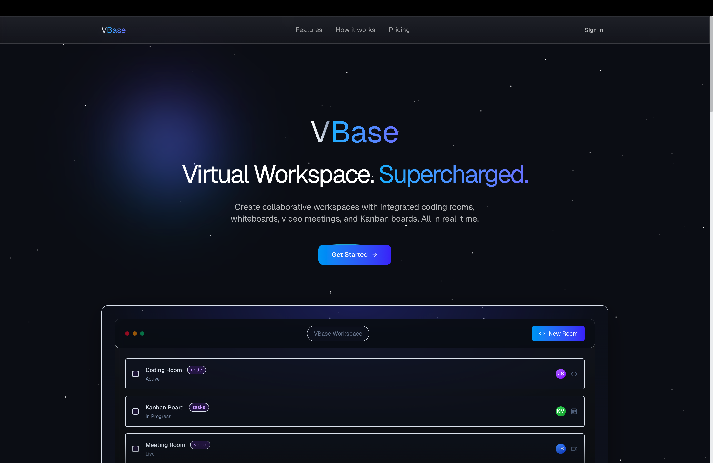
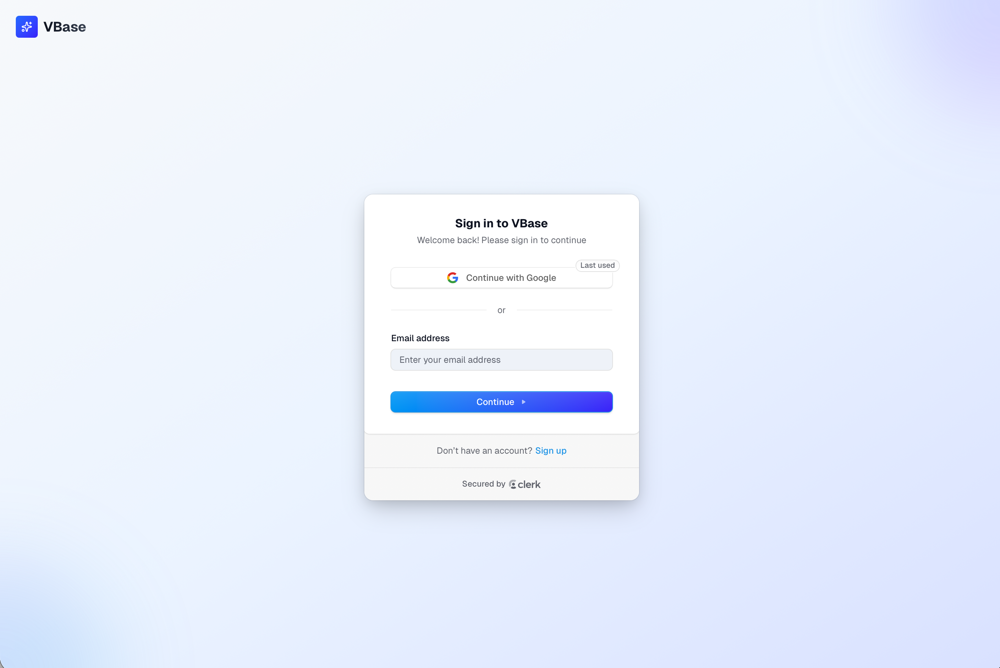
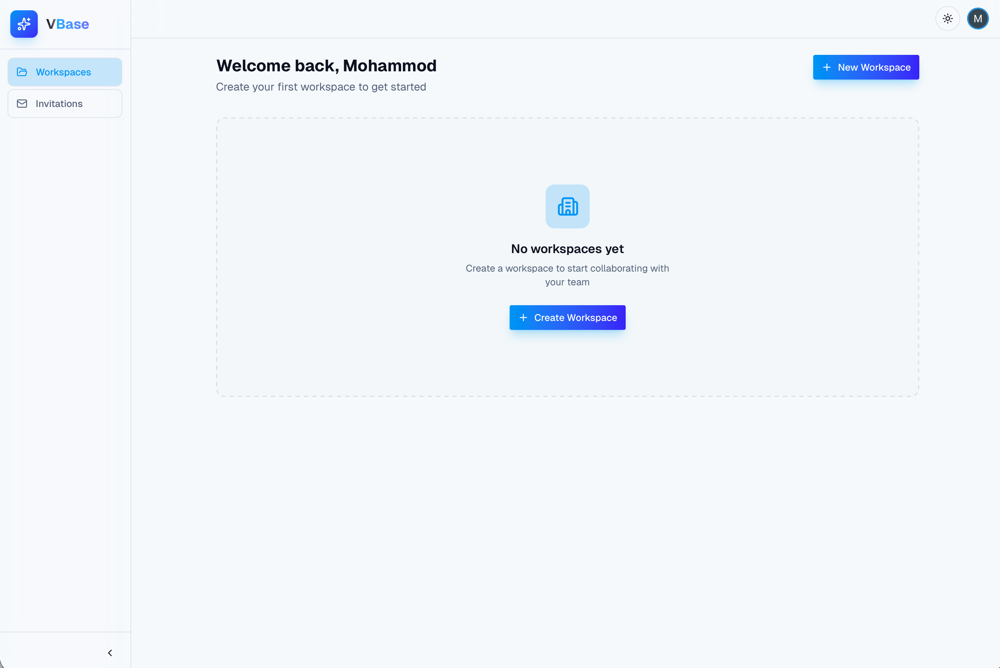
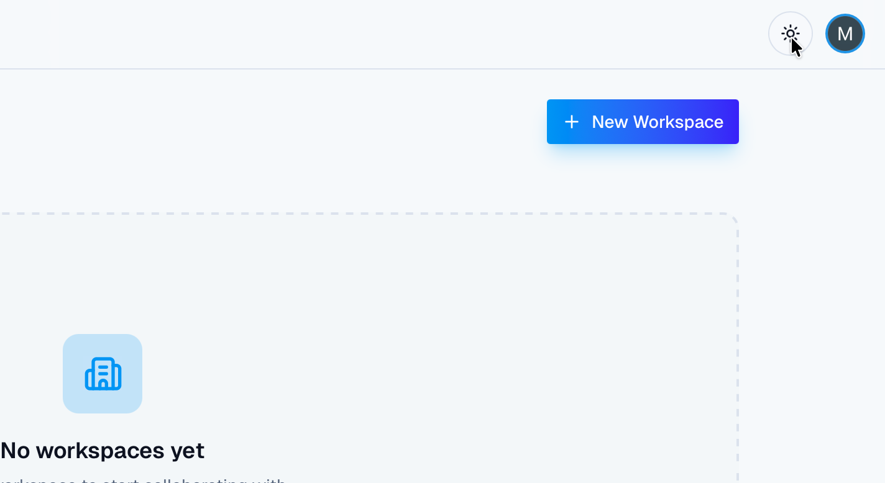
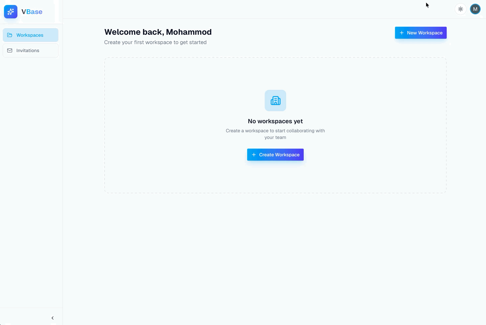
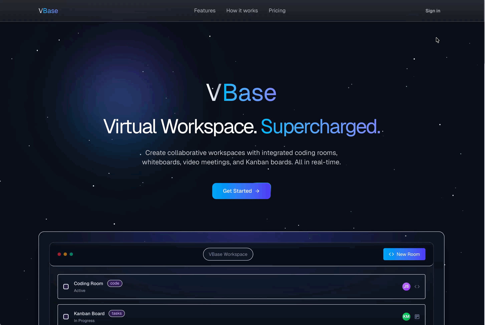

# Getting Started with VBase

This page helps a first-time user move from the landing page to a ready-to-use dashboard. By the end of this guide, you should be signed in and know where to go next.

---

## Table Of Contents

1. [Before You Begin](#before-you-begin)
2. [Create An Account](#create-an-account)
3. [Sign In To Your Account](#sign-in-to-your-account)
4. [Understand The Dashboard](#understand-the-dashboard)
5. [Switch Theme And Basic Preferences](#switch-theme-and-basic-preferences)
6. [Your First Next Step](#your-first-next-step)
7. [Common First-Time Questions](#common-first-time-questions)

---

## Before You Begin

Before you start:

1. Make sure you can access the VBase app in your browser.
2. Decide whether you need to create a new account or sign in with an existing one.
3. If someone already invited you to a workspace, plan to check the Invitations page after signing in.

---

## Create An Account

If you do not already have an account:

1. Open the VBase landing page.
2. Select `Get Started`.
3. On the authentication screen, choose the sign-up option if you are a new user.
4. Complete the account creation steps shown by the form.

Caption: Start from the landing page and select Get Started to begin sign-in.

Caption: New users can create an account from the sign-up page.

---

## Sign In To Your Account

If you already have an account:

1. Open the VBase landing page.
2. Select `Get Started` or move directly to the sign-in page.
3. Enter your sign-in details.
4. Complete any required verification step.
5. After authentication, VBase redirects you to the dashboard.

Caption: Existing users can sign in here and are redirected to the dashboard.

---

## Understand The Dashboard

After you sign in, the dashboard is your main starting point.

Use the dashboard to:

1. View your workspaces.
2. Create a new workspace.
3. Open the Invitations page from the left sidebar.
4. Switch between `All`, `Owned`, and `Joined` workspace filters.

If this is your first time, you may see an empty state instead of workspace cards.

Caption: After signing in, the dashboard becomes your main starting point.

Caption: If this is your first time, you may see an empty state prompting you to create your first workspace.

---

## Switch Theme And Basic Preferences

The dashboard header includes a theme toggle.

To change the visual theme:

1. Look at the top-right area of the dashboard.
2. Select the theme toggle.
3. Switch between light and dark mode.

Caption: You can switch the visual theme from the dashboard header at any time.

Caption: Use the theme toggle in the header to change the app appearance.

---

## Your First Next Step

Once you reach the dashboard, choose the path that matches your situation:

### If you are starting your own workspace

Go to [Create and Manage Workspaces](./02-create-and-manage-workspaces.md).

### If someone already invited you

Go to [Invite and Join Team Members](./03-invite-and-join-team-members.md) and open the invitation acceptance section.

Caption: This is the full first-time path from landing page to dashboard access.

---

## Common First-Time Questions

### Why is my dashboard empty?

If you have not created or joined a workspace yet, the dashboard may show an empty state.

### Where do invitations appear?

Invitations appear on the `Invitations` page in the dashboard sidebar.

### Do I need to create a workspace before inviting others?

Yes. You need a workspace before you can invite teammates into it.

---

## Related Guides

- [VBase User Guide](./README.md)
- [Create and Manage Workspaces](./02-create-and-manage-workspaces.md)
- [Invite and Join Team Members](./03-invite-and-join-team-members.md)