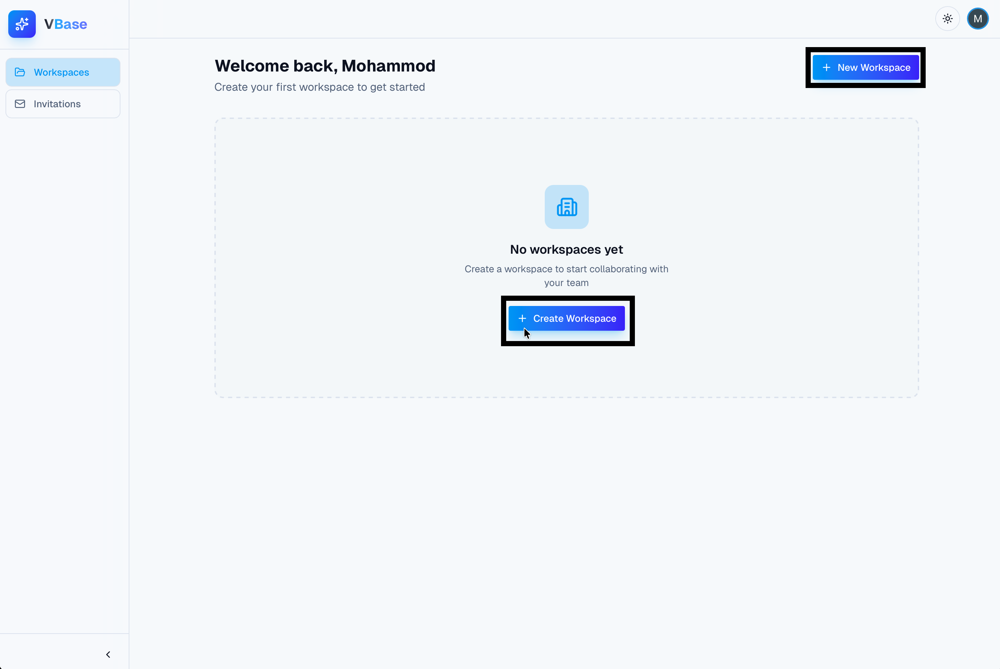
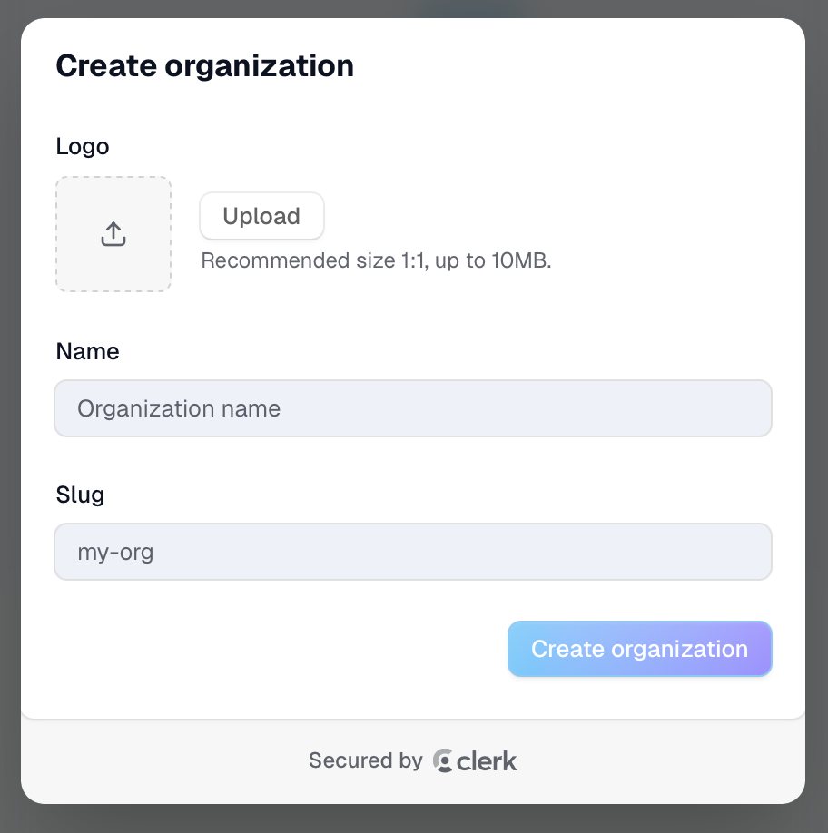
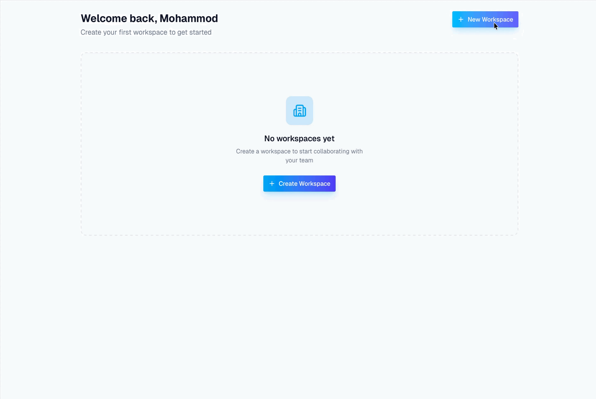

# Create and Manage Workspaces

This page shows how to create a workspace, move around inside it, and manage the basic settings that matter to team collaboration.

---

## Table Of Contents

1. [What A Workspace Is](#what-a-workspace-is)
2. [Create A New Workspace](#create-a-new-workspace)
3. [Open And Navigate A Workspace](#open-and-navigate-a-workspace)
4. [Use Workspace Filters On The Dashboard](#use-workspace-filters-on-the-dashboard)
5. [Understand Workspace Stats And Limits](#understand-workspace-stats-and-limits)
6. [Manage Workspace Settings](#manage-workspace-settings)
7. [See Active Users And Workspace Activity](#see-active-users-and-workspace-activity)
8. [Common Issues](#common-issues)

---

## What A Workspace Is

A workspace is the main collaboration area for a team, class group, or project.

Inside a workspace, you can:

1. Invite members.
2. Create rooms for different tasks.
3. Track basic room and member counts.
4. Open settings to manage members.

---

## Create A New Workspace

To create a workspace:

1. Open the `My Workspaces` dashboard page.
2. Select `Create Workspace`.
3. Enter a workspace name.
4. Select `Create Workspace` in the modal.
5. Wait for the workspace to appear in your workspace list.

Caption: Use Create Workspace to start a new collaborative space.

Caption: Enter a workspace name, then confirm to create it.

Caption: Open the modal, name the workspace, and create it from the dashboard.

Placeholder media to capture during docs QA.

---

## Open And Navigate A Workspace

Once a workspace exists:

1. Find it in the workspace grid.
2. Select the workspace card.
3. Review the workspace header and the room list area.
4. Use `Back to Dashboard` when you need to return.

Caption: Each workspace card shows the workspace name, member count, and your role.

Caption: The workspace home page shows your rooms, members, and key actions.

Placeholder media to capture during docs QA.

---

## Use Workspace Filters On The Dashboard

The dashboard includes filters to help you find workspaces faster.

Use them like this:

1. Select `All` to see every workspace available to you.
2. Select `Owned` to see workspaces where you are an admin.
3. Select `Joined` to see workspaces you belong to but do not own.

Caption: Use the filters to focus on the workspaces you own or have joined.

Placeholder media to capture during docs QA.

---

## Understand Workspace Stats And Limits

Inside a workspace, the main page shows quick stats for:

1. `Rooms`
2. `Members`

Important limits:

1. A user can own up to 5 workspaces.
2. A workspace can contain up to 10 rooms.
3. A workspace can contain up to 10 members.

Use these numbers to decide when to clean up unused rooms or create a different workspace.

---

## Manage Workspace Settings

To open workspace settings:

1. Enter the workspace.
2. Select the `Settings` button in the header.
3. Use the `Manage Members` area to review organization settings and member management options.

Caption: Open Workspace Settings to manage members and organization details.

Caption: After creating or selecting a workspace, open its settings to manage members and details.

Placeholder media to capture during docs QA.

---

## See Active Users And Workspace Activity

The workspace header may show active user indicators.

Use this area to:

1. See who is currently active in the workspace.
2. Confirm that teammates are present before starting collaboration.

Caption: Active user indicators help you see who is currently present in the workspace.

Placeholder media to capture during docs QA.

---

## Common Issues

### I cannot create another workspace

You may have reached the ownership limit.

### My workspace does not appear immediately

Wait a moment and refresh the dashboard if needed.

### I do not see settings options I expected

Some management actions depend on your role in the workspace.

---

## Related Guides

- [VBase User Guide](./README.md)
- [Getting Started with VBase](./01-getting-started.md)
- [Invite and Join Team Members](./03-invite-and-join-team-members.md)
- [Create and Open Rooms](./04-create-and-open-rooms.md)